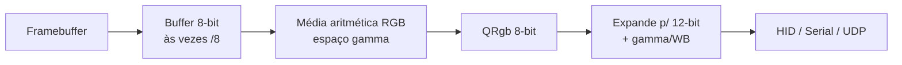
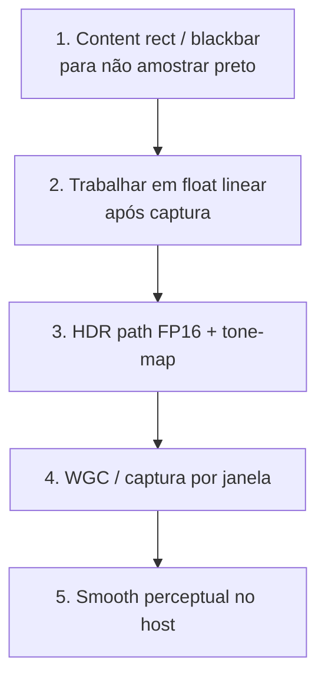

# A captação de cor do Prismatik ainda é moderna?

Análise do método de captura e cálculo de cor (Ambilight) frente a práticas de 2025–2026.

Documento complementar a:

- [`pipeline-captura-processamento-leds.md`](./pipeline-captura-processamento-leds.md)
- [`gargalos-sistema-moderno-2026.md`](./gargalos-sistema-moderno-2026.md)
- [`pesquisa-zonas-led-content-aware.md`](./pesquisa-zonas-led-content-aware.md)

---

## 1. Veredito

**Parcialmente.**

| Camada | Ainda moderna? |
|--------|----------------|
| Ideia geral: amostrar bordas → cor por LED → hardware | **Sim** — padrão da indústria |
| DXGI Desktop Duplication + downscale (este fork) | **Sim, com ressalvas** — válido; WGC/HDR são o passo seguinte |
| Média aritmética RGB 8-bit em espaço gamma | **Não** — legado competente, não cutting-edge |
| Pipeline sem HDR / float / linear | **Não** — gap claro em desktops/jogos HDR 2026 |

Para Ambilight “bom o suficiente”, ainda serve.  
Para parecer atual frente a HyperHDR / Hue / Govee em HDR, ultrawide e cenas escuras, precisa evoluir.

---

## 2. O que o Prismatik faz hoje

### 2.1 Captura

| Plataforma | Implementação | Formato típico |
|------------|---------------|----------------|
| Windows (preferencial neste fork) | `DDuplGrabber` — Desktop Duplication API | 8-bit BGRA/RGBA; downscale mip **/8** |
| Windows (fallback) | `WinAPIGrabber` — BitBlt/GDI | 8-bit ARGB |
| Windows (jogos) | `D3D10Grabber` — hooks | complementar |
| Linux | `X11Grabber` — MIT-SHM | 8-bit |
| macOS | CoreGraphics / AVFoundation | 8-bit |

Arquivos: `Software/grab/DDuplGrabber.cpp`, `GrabberBase.cpp`, etc.

### 2.2 Cálculo de cor por LED

`Grab::Calculations::calculateAvgColor` (`Software/grab/calculations.cpp`):

1. Recorta a zona (`GrabWidget`) no buffer capturado
2. Soma R, G, B de todos os pixels
3. Divide por `width × height`
4. Devolve `QRgb` **8-bit**
5. Otimizações: scalar → SSE4.1 → AVX2 → AVX512

Depois, no device host (`AbstractLedDevice::applyColorModifications`):

- expande 8-bit → 12-bit interno (`× 4095/255`)
- gamma, Lab threshold, brilho, WB, caps, dither

Ou seja: a precisão “extra” 12-bit nasce **depois** de já ter truncado a média em 8-bit.

---

## 3. O que ainda é moderno (e por quê)

### 3.1 Amostragem por zonas de borda

Hyperion.ng, HyperHDR, Adrilight, Hue Sync, Govee AI Sync — todos, em essência:

> região na borda → cor representativa → LED correspondente

Não há, no mercado de Ambilight de consumo, um substituto dominante que abandonou esse modelo. O que mudou é **como** se obtém e processa essa cor.

### 3.2 Desktop Duplication no Windows

DDupl ainda é API oficial e adequada para captura de monitor inteiro pós-DWM. Este fork já:

- usa acquire com timeout 0 (ritmo pelo timer)
- downscale via mipmaps (barateia a média)
- trata rotação/escala nas coordenadas da zona

Isso continua alinhado com práticas sérias de screen capture.

### 3.3 SIMD na redução

Usar AVX/SIMD para acumular pixels é adequado. Em 2026 o custo da média nem é o problema — mas a implementação não é “antiga por ser burra”; é antiga por ser **conceitualmente 8-bit/gamma**.

---

## 4. O que envelheceu

### 4.1 Média aritmética em espaço gamma (8-bit)

Problemas conhecidos:

- pixels claros **dominam** a média (espaço não-linear)
- UI chrome / legendas brancas “puxam” a cor da zona
- cenas escuras sofrem quantização cedo
- banding / posterização quando se reexpande para 12-bit depois

**Estado da arte (HyperHDR Infinite Color Engine, v22):**

- aritmética **floating-point** de ponta a ponta
- transformações em **sRGB linear**
- smoothing perceptual (YUV/RGB, histerese, interpoladores modernos)
- deep-color para sinks que suportam (>24-bit efetivo)

Fontes:
- https://github.com/awawa-dev/HyperHDR
- https://github.com/awawa-dev/HyperHDR/wiki/Infinite-color-engine

### 4.2 Truncamento precoce para `QRgb`

Mesmo com device 12-bit e dither, a informação já foi perdida na média 8-bit. HyperHDR enfatiza exatamente o oposto: a média teórica já tinha precisão; truncar a 24-bit cedo era o erro.

### 4.3 Sem HDR

Desktop/jogos HDR em 2026 são comuns. O Prismatik:

- só aceita formatos 8-bit no DDupl (`mapDXGIFormatToBufferFormat`)
- FP16 / 10-bit → `BufferFormatUnknown` → frame dropado ou caminho inválido
- sem tone-map (BT.2390, ICtCp, etc.)

Práticas modernas de captura Windows:

| Abordagem | Detalhe |
|-----------|---------|
| DXGI / WGC em `R16G16B16A16_FLOAT` | Mantém sinal HDR |
| Tone-map para SDR (BT.2390 / ICtCp) | Antes de quantizar |
| Âncora no SDR reference white do monitor | UI não “lava” |
| Fallback 8-bit | Se HDR path falhar |

Exemplos de ecossistema: forks/tools HDR-aware (ShareX-HDR, capscr), docs Microsoft de Advanced Color / WGC.

### 4.4 API de captura: DDupl vs Windows Graphics Capture

OBS e apps modernos migraram/oferecem **Windows Graphics Capture (WGC)** porque:

- funciona melhor **cross-GPU**
- captura **por janela** ou por monitor
- ergonomia WinRT mais atual

DDupl continua válido para “monitor inteiro”, mas não é mais o único (nem sempre o melhor) caminho em 2026.

### 4.5 Sem content-aware na amostragem

Mesmo com média perfeita, se a zona está em **barra preta** (UW + filme 16:9), a cor “moderna” ainda é preto. Sistemas modernos acoplam:

- blackbar detection
- crop lógico
- remap (clamp) para borda ativa

Ver [`pesquisa-zonas-led-content-aware.md`](./pesquisa-zonas-led-content-aware.md).

### 4.6 Smooth no firmware vs smooth no host

O feeling de cor “moderna” depende tanto do cálculo quanto da **temporalização**:

- Prismatik Lightpack: interpolação `start→end` no AVR (default lento)
- HyperHDR: smoothing avançado no host em float, com vários interpoladores

Ver [`gargalos-sistema-moderno-2026.md`](./gargalos-sistema-moderno-2026.md).

---

## 5. Comparativo rápido

| Aspecto | Prismatik (hoje) | Prática moderna 2026 |
|---------|------------------|----------------------|
| Fonte | Desktop blit (DDupl/GDI/X11) | DDupl **ou** WGC / window capture / HDMI grabber |
| Bit depth captura | 8-bit | FP16 HDR + tone-map → working space |
| Espaço da média | RGB gamma 8-bit | Linear / float (às vezes YUV perceptual) |
| Redução espacial | Mean | Mean (ainda comum); às vezes pesos / ignore-black |
| Content rect | Fixo (boxes) | Blackbar + histerese + políticas |
| Smooth | Firmware / simples | Host float, multi-algoritmo |
| Destino | 12-bit packed / 8-bit serial | 8–16 bit + deep-color onde existe |

---

## 6. O que **não** precisa ser reinventado

Não é necessário abandonar “média de zona”:

1. A indústria ainda usa redução espacial por região de LED
2. Downscale antes da média (mip /8) continua excelente ideia
3. SIMD na acumulação continua válido
4. Separar grab thread de I/O de device continua correto

O upgrade é **pipeline de cor e de conteúdo**, não trocar Ambilight por outra metáfora.

---

## 7. Evolução sugerida (só captação/cor)

Ordem de alavancagem:

| Fase | Mudança | Ganho |
|------|---------|-------|
| A | Blackbar + clamp | Cor “certa” em UW/cinema |
| B | Média/processamento em float linear; quantizar só no fim | Cenas escuras, menos banding, WB/gamma corretos |
| C | Captura HDR-aware | Jogos/desktop HDR utilizáveis |
| D | WGC / window capture | Cross-GPU + player em janela |
| E | Smooth no host | Feeling moderno sem gelatina do AVR |

Detalhes de zonas/AR: doc de content-aware.  
Detalhes de FPS/latência: doc de gargalos.

---

## 8. Resposta direta

> Esse método de captação de cor ainda é moderno?

- **Sim**, na concepção (bordas → média → LEDs) e no uso de DDupl+downscale.  
- **Não**, na qualidade do pipeline de cor (8-bit gamma, sem HDR, sem float/linear, sem content-aware, smooth legado).

É um método **clássico e ainda válido**, não o estado da arte de 2026.

---

## 9. Referências

### Código local
- `Software/grab/calculations.cpp` — `calculateAvgColor`
- `Software/grab/DDuplGrabber.cpp` — captura + mip /8 + formatos 8-bit
- `Software/grab/GrabberBase.cpp` — orquestração por zona
- `Software/src/AbstractLedDevice.cpp` — 8→12 bit, gamma, dither

### Externas
- HyperHDR Infinite Color Engine: https://github.com/awawa-dev/HyperHDR/wiki/Infinite-color-engine
- HyperHDR: https://github.com/awawa-dev/HyperHDR
- Microsoft: Using DirectX with HDR and Advanced Color
- Microsoft: Screen capture (Windows.Graphics.Capture) — recomenda FP16 em HD Color
- OBS community: DXGI Desktop Duplication vs Windows Graphics Capture
- Exemplos HDR-aware capture: ShareX-HDR, capscr (FP16 + tone-map)
