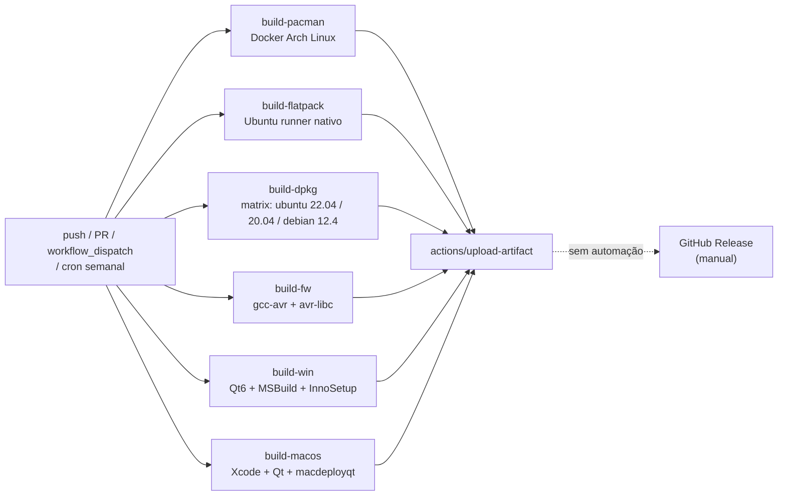
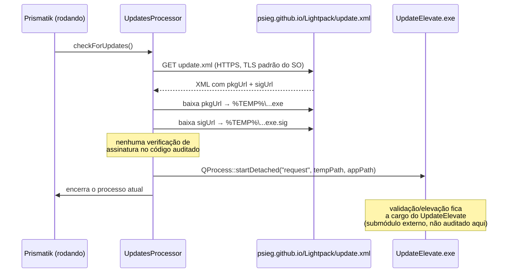

# CI, build e release — o que existe de fato

Mapeamento do pipeline real de integração contínua, empacotamento e atualização do Prismatik/Lightpack, com base no código deste repositório (não na intenção do README).

Ver também: [índice](./README.md)

---

## 1. Veredito

**CI builda 6 alvos em 3 SOs, mas não executa um único teste, e não existe publicação automatizada de release.**

| Pergunta | Resposta |
|---|---|
| CI compila em Linux/Windows/macOS/firmware? | **Sim** — 6 jobs |
| CI roda `LightpackTests`? | **Não, em nenhum job** |
| Existe automação que cria/publica um GitHub Release? | **Não** — releases são manuais |
| Versão do app é derivada automaticamente (tag/semver)? | **Não** — dois arquivos mantidos manualmente em paralelo |
| O auto-updater valida a assinatura do instalador baixado? | **Não, não no código auditado** — delega a um binário externo não lido aqui |

---

## 2. `.github/workflows/ci.yml` — os 6 jobs

Único workflow do repositório (`find .github -type f` não retorna mais nada). Dispara em `push`, `pull_request`, `workflow_dispatch` e num `schedule` semanal (`cron: '43 17 * * FRI'`, sexta-feira 17:43 UTC) — o cron existe provavelmente para pegar quebras causadas por mudanças no ambiente de build (imagens Docker, Qt, etc.) mesmo sem commits novos.



| Job | Ambiente | O que faz | file:line |
|---|---|---|---|
| `build-pacman` | Docker (Arch) | Build via `build-in-docker.sh pacman archlinux latest` | `ci.yml:12-31` |
| `build-flatpack` | Ubuntu 20.04 nativo | Instala `flatpak`/`flatpak-builder`, adiciona remote Flathub, builda via `build-natively.sh flatpak` | `ci.yml:33-58` |
| `build-dpkg` | Docker, matrix 3 distros | `build-in-docker.sh dpkg <os>` para `ubuntu 22.04`, `ubuntu 20.04`, `debian 12.4` | `ci.yml:60-82` |
| `build-fw` | Ubuntu nativo | `apt-get install gcc-avr avr-libc build-essential` + `./build_batch.sh` (todas as versões de hardware) | `ci.yml:84-97` |
| `build-win` | Windows Server 2019 | Qt 6 via `install-qt-action`, BASS/NightLight baixados de URLs externas em runtime, `generate_sln.bat` → `MSBuild.exe`, depois `prepare_installer.sh` + InnoSetup | `ci.yml:99-182` |
| `build-macos` | macOS 11 | Qt via `aqtinstall`, `qmake -r && make && macdeployqt ... -dmg` | `ci.yml:184-249` |

Todo job termina em `actions/upload-artifact@v4` — o artefato fica anexado ao run do Actions, baixável manualmente. **Nenhum job cria tag, publica GitHub Release ou faz upload para um endpoint de distribuição** (`grep -rn "release create\|softprops\|actions/create-release\|gh release" .github/` não retorna nada).

### 2.1 Não existe build Linux "solto"

Não há um job que rode `qmake -r && make` diretamente no runner Ubuntu para Linux. Cada backend de pacote roda dentro de um container Docker:

- `build-in-docker.sh` monta a imagem do backend/distro e executa, dentro do container, `cd dist_linux && ./build-natively.sh <backend>`.
- `build-natively.sh` apenas faz `cd <backend> && ./build.sh` — o `qmake`/`make`/empacotamento real vive em cada `<backend>/build.sh` (ex. `dpkg/build.sh`, `pacman/build.sh`).

Ou seja: testar um build "genérico" de Linux fora de um backend de pacote específico não é algo que o CI cobre.

### 2.2 Testes: confirmado — zero execução no CI

`grep -ni "test" .github/workflows/ci.yml` só retorna falsos positivos (`Test-Path` do PowerShell, `aqt list-qt`). O alvo `LightpackTests` (`Software/tests/tests.pro`) só entra no `SUBDIRS` do projeto **quando `win32`** (`Software/Lightpack.pro:40`) — e mesmo assim, o passo `Build` do job `build-win` só roda `MSBuild.exe Lightpack.sln /p:Configuration=Release` (`ci.yml:160`), que **compila** a suíte de testes, mas nunca a **executa**. Nos jobs Linux, `tests` nem entra no `SUBDIRS`. Ver [`cobertura-testes.md`](./cobertura-testes.md) para o detalhamento de o que essa suíte cobriria, se rodasse.

---

## 3. `.travis.yml` — CI legado redundante (e com upload real)

O `.travis.yml` na raiz ainda existe e builda **só macOS**: `qmake -r && make && macdeployqt bin/Prismatik.app -dmg` (`.travis.yml:24-26`) — exatamente o mesmo procedimento do job `build-macos` do `ci.yml` (`ci.yml:234-236`). É trabalho duplicado entre dois sistemas de CI.

A diferença relevante: o Travis **tem** um passo de upload real —

```sh
curl -T bin/Prismatik.dmg "https://psieg.de/lightpack/osx_builds/Prismatik_${VERSION}_${TRAVIS_BUILD_NUMBER}.dmg" \
  -u "${PSIEG_UPLOAD_USER}:${PSIEG_UPLOAD_PASSWORD}"
```

(`.travis.yml:33`, condicionado a branch `master` e não ser PR) — publicando em `psieg.de`, domínio do mantenedor original. As credenciais (`PSIEG_UPLOAD_USER`/`PASSWORD`) não estão no repositório (seriam secrets do Travis), então é impossível confirmar se esse upload ainda funciona hoje. O `ci.yml` (GitHub Actions) **não replica esse upload** — só artifact de run. Ou seja: dos dois sistemas de CI, um está morto/indeterminado mas *tenta* publicar; o outro funciona mas não publica nada automaticamente.

---

## 4. Versionamento — dois arquivos manuais em paralelo

| Arquivo | Conteúdo | Usado por |
|---|---|---|
| `Software/RELEASE_VERSION` | `5.11.2.31` (9 bytes, sem newline) | `flatpak/build.sh:5`, `dpkg/build.sh:10`, `ci.yml:240` (nome do `.dmg`) |
| `Software/src/version.h:30` | `VERSION_STR "5.11.2.31"` | Código/UI/`UpdatesProcessor` |

Os dois arquivos têm o mesmo valor hoje, mas **não há nenhum script que os sincronize** (`grep -rln "RELEASE_VERSION" --include="*.py" --include="*.sh"` não encontra automação de sync). Bump de versão é 100% manual, com risco de esquecer um dos dois arquivos.

Separadamente, `GIT_REVISION` é injetado em build-time via `git show -s --format="%h"` (`Software/src/src.pro:32`) — é o hash curto do commit, não uma versão semântica; aparece só no about/`--help`.

---

## 5. Empacotamento Linux (`Software/dist_linux/`)

Três backends com Dockerfile + `build.sh` próprios: `dpkg/`, `pacman/`, `flatpak/` (este último roda nativo no CI, não via Docker). Fluxo: `build-in-docker.sh <backend> <os-image> <tag>` builda a imagem do backend/distro escolhido e roda o container montando o repositório; dentro dele, `build-natively.sh <backend>` delega para o `build.sh` daquele backend, que faz o `qmake`/`make`/empacotamento específico daquela distro.

---

## 6. Windows — cadeia build → instalador

1. `scripts/win32/generate_sln.bat` roda `qmake -tp vc` e ajusta os `.vcxproj`/`.sln` gerados (runtime estático, Win32).
2. `MSBuild.exe Lightpack.sln /p:Configuration=Release` compila.
3. `scripts/win32/prepare_installer.sh` compila o submódulo `Software/UpdateElevate` (repositório externo `psieg/UpdateElevate`, `.gitmodules:1-3`) via `build_UpdateElevate.bat` e copia o binário/DLLs para `dist_windows/content`.
4. `dist_windows/script_qt6.iss` (InnoSetup) empacota tudo e registra `UpdateElevate.exe` para rodar `install`/`uninstall` — é o mesmo binário usado depois pelo auto-updater em runtime (seção 7).

---

## 7. Auto-update (`Software/src/UpdatesProcessor.cpp`) — superfície de segurança



Fatos verificados:

- Endpoint: `https://psieg.github.io/Lightpack/update.xml` (`UpdatesProcessor.cpp:39`, GitHub Pages/HTTPS; há uma linha comentada com o endpoint antigo `psieg.de`, `:38`).
- TLS: usa `QSslConfiguration::defaultConfiguration()` (`:64,115,156`) — validação padrão do sistema, **sem certificate pinning**.
- Baixa dois artefatos do XML — `pkgUrl` (instalador) e `sigUrl` (assinatura) — salvando ambos em `%TEMP%\PsiegUpdateElevate_Prismatik.exe[.sig]` (`:145,180`).
- **O `UpdatesProcessor.cpp` nunca verifica a assinatura baixada.** Ele baixa `.exe` e `.sig` e imediatamente dispara `UpdateElevate.exe request <tempPath> <appPath>` via `QProcess::startDetached` (`:194-199`), encerrando o processo atual. Se há verificação criptográfica real, ela está dentro do binário `UpdateElevate` (submódulo `psieg/UpdateElevate`, código fora deste repositório — não auditado neste documento).
- Redirects HTTP são restringidos com `NoLessSafeRedirectPolicy` (`:117,158`) — protege contra downgrade HTTPS→HTTP via redirect, pelo menos nesse ponto.
- Comparação de versão (`isVersionMatches`, `:206-263`) é puramente string-based — não tem relação com segurança, só decide se há update disponível.

**Implicação prática**: a cadeia de confiança do auto-update depende inteiramente de código que vive fora deste repositório (`UpdateElevate`). Qualquer auditoria de segurança do mecanismo de update precisa necessariamente incluir esse submódulo — avaliar só `UpdatesProcessor.cpp` dá uma falsa sensação de completude.

---

## 8. Arquivos-âncora

| Área | Arquivo |
|---|---|
| CI | `.github/workflows/ci.yml` |
| CI legado | `.travis.yml` |
| Versionamento | `Software/RELEASE_VERSION`, `Software/src/version.h` |
| Empacotamento Linux | `Software/dist_linux/{dpkg,pacman,flatpak}/{Dockerfile,build.sh}`, `build-in-docker.sh`, `build-natively.sh` |
| Empacotamento Windows | `scripts/win32/generate_sln.bat`, `scripts/win32/prepare_installer.sh`, `Software/dist_windows/script_qt6.iss` |
| Submódulo updater | `.gitmodules`, `Software/UpdateElevate/` (não auditado em detalhe) |
| Auto-update | `Software/src/UpdatesProcessor.cpp`/`.hpp` |
