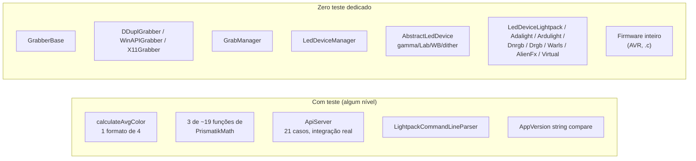

# Cobertura de testes — o que `LightpackTests` realmente cobre

Auditoria das 5 suítes de teste existentes (`Software/tests/`) contra o pipeline real do Ambilight (ver [`pipeline-captura-processamento-leds.md`](./pipeline-captura-processamento-leds.md)), para saber o que está protegido por teste e o que não está.

Ver também: [índice](./README.md) · [CI/build/release](./ci-build-release.md) · [captação de cor](./captacao-cor-ainda-moderna.md)

---

## 1. Veredito

**A suíte existe, compila, e tem alguns testes de integração reais — mas cobre uma fração pequena do pipeline crítico, não roda no CI (ver [`ci-build-release.md`](./ci-build-release.md) §2.2), e a parte mais nova/interessante do pipeline de cor (conversão Lab/XYZ) não tem nenhum teste.**

| Suíte | Casos | Profundidade |
|---|---|---|
| `GrabCalculationTest` | 1 | Trivial — só 1 dos 4 formatos de buffer, buffer uniforme |
| `LightpackMathTest` | 1 | Superficial — só 3 de ~19 funções públicas de `PrismatikMath` |
| `LightpackApiTest` | 21 | **Real** — integração de rede ponta a ponta contra `ApiServer` |
| `AppVersionTest` | 5 | Real, mas escopo pequeno |
| `LightpackCommandLineParserTest` | 7 | Real, boa cobertura do parser de CLI |

---

## 2. O que cada suíte cobre de fato

### 2.1 `GrabCalculationTest` — 1 caso

`Software/tests/GrabCalculationTest.cpp:3-9`: testa `Grab::Calculations::calculateAvgColor` com um buffer de 16 bytes **uniforme** (`0xfa` em todo lugar), formato `BufferFormatArgb`, `QRect(0,0,4,1)`. Confirma que a média de um buffer uniforme dá o próprio valor — não testa média de pixels diferentes entre si.

**Não cobertos**: dos 4 formatos que `calculateAvgColor` suporta (`Argb`, `Abgr`, `Rgba`, `Bgra` — `calculations.cpp:454-479`), só `Argb` tem teste. Os caminhos SIMD (scalar → SSE4.1 → AVX2 → AVX512, `calculations.cpp:440-448`, documentados em [`gargalos-sistema-moderno-2026.md`](./gargalos-sistema-moderno-2026.md)) nunca são exercitados por teste — o dispatch de CPU feature detection roda "no escuro".

### 2.2 `LightpackMathTest` — 1 caso

`lightpackmathtest.cpp:9-17`: testa só `getValueHSV`, `withChromaHSV` (2 valores) e um round-trip `withChromaHSV(rgb, getChromaHSV(rgb)) == rgb`.

**Não cobertos** — de `PrismatikMath.hpp:36-56`: `gammaCorrection`, `brightnessCorrection`, `maxCorrection`, `applyColorTemperature`, `whitePoint`, `avgColor`, `toXyz`, `toLab`, `toRgb`, `getBrightness`, `theoreticalMaxFrameRate`, `theoreticalMinBaudRate`. Isso inclui **toda a conversão RGB↔XYZ↔Lab em ponto flutuante** que usamos para corrigir a afirmação "pipeline sem float/linear" em [`captacao-cor-ainda-moderna.md`](./captacao-cor-ainda-moderna.md) — ou seja, o código que prova que o Prismatik já processa cor em espaço linear (`PrismatikMath.cpp`, EOTF sRGB + Lab) roda em produção **sem nenhuma rede de segurança de teste**. Se alguém mexer em `toXyz`/`toLab`/`toRgb`, nada no CI detectaria uma regressão numérica.

### 2.3 `LightpackApiTest` — 21 casos (a suíte séria)

`LightpackApiTest.cpp:1-765`. Sobe um `ApiServer` real numa thread própria, porta `3636` (`initTestCase`, linhas 53-85), e conversa com ele via `QTcpSocket` de verdade — é teste de integração ponta a ponta do protocolo de rede documentado em [`ecossistema-plugin-api.md`](./ecossistema-plugin-api.md), não um mock. Cobre: handshake/versão, `GetStatus`/`GetStatusAPI`, `GetProfiles` (incluindo nomes UTF-8), `GetProfile`, `Lock`/`Unlock`, `SetColor` (válido/inválido, data-driven), `SetGamma`, `SetBrightness`, `SetSmooth` (idem, data-driven), `SetProfile`, `SetStatus`, e autenticação por API key (`testCase_ApiAuthorization`, linha 677).

Ressalva: depende de porta TCP fixa (3636) livre e de timers de rede — potencialmente instável/lento em ambiente de CI headless (não há evidência no repo de configuração `QT_QPA_PLATFORM=offscreen`/`xvfb`, mas também não foi necessário até hoje porque **este job nunca roda no CI** — ver seção 4).

### 2.4 `AppVersionTest` e `LightpackCommandLineParserTest`

Pequenas mas legítimas — não tautológicas. `AppVersionTest.cpp:35-73` (5 casos: igualdade explícita/implícita, desigualdade, `<`, `>`) testa `AppVersion` (`UpdatesProcessor.hpp:29`, o mesmo componente do auto-updater documentado em [`ci-build-release.md`](./ci-build-release.md) §7 — mas só a comparação de string de versão, não o download/instalação). `LightpackCommandLineParserTest.cpp:14-104` (7 casos) cobre bem `--version`, `--help`, `--wizard`, `--on`/`--off` (incluindo o caso de conflito `--on --off`), e `--debug=<nível>` data-driven.

---

## 3. O pipeline crítico sem nenhum teste dedicado

`Software/tests/tests.pro` (`SOURCES`, linhas 66-80) só compila `ApiServerSetColorTask.cpp`, `ApiServer.cpp`, `Settings.cpp`, `Plugin.cpp`, `LightpackPluginInterface.cpp`, `LightpackCommandLineParser.cpp`, `UpdatesProcessor.cpp` — mais os 5 arquivos de teste. Para `grab`, só linka `-lgrab` (`tests.pro:31`) e usa `calculateAvgColor`.



Nenhuma das seguintes classes tem arquivo ou caso de teste dedicado (confirmado — não aparecem em `SOURCES`/`HEADERS` de `tests.pro`):

- `GrabberBase` (`Software/grab/GrabberBase.cpp`) — o timer/loop de captura inteiro, incluindo o cálculo de zonas por tela.
- `DDuplGrabber`, `WinAPIGrabber`, `X11Grabber` — todos os grabbers por plataforma.
- `GrabManager` (`Software/src/GrabManager.cpp`) — pós-processamento (temperatura, overbrighten, diff de frame).
- `LedDeviceManager` (`Software/src/LedDeviceManager.cpp`) — fila, coalescing, timeout, thread de device.
- `AbstractLedDevice`/`AbstractLedDeviceUdp` — gamma, Lab threshold, WB, dither, cap de corrente.
- Todos os `LedDevice*` concretos: `Lightpack`, `Adalight`, `Ardulight`, `Dnrgb`, `Drgb`, `Warls`, `AlienFx`, `Virtual`.
- `Settings` (`Software/src/Settings.cpp`) — **é compilado** (dependência de `LightpackApiTest`, `tests.pro:69`) e exercitado *indiretamente* via chamadas dentro de `LightpackApiTest.cpp` (ex.: `findAllProfiles`, `loadOrCreateProfile`), mas não tem suíte própria.

Ou seja: exatamente o caminho que os outros documentos desta pasta analisam em detalhe — captura, pós-processamento, fila de device, correção de cor, empacotamento por protocolo — é o caminho sem rede de segurança nenhuma. Uma regressão em `AbstractLedDevice::applyColorModifications` (o pipeline de gamma/Lab/WB/dither auditado em [`captacao-cor-ainda-moderna.md`](./captacao-cor-ainda-moderna.md)) não seria pega por nenhum teste automatizado hoje.

---

## 4. Firmware: zero testes

Confirmado categoricamente: `grep -rniw "test"` restrito a `Firmware/*.c`/`*.h` (excluindo o vendored `Firmware/LUFA/`) não retorna nada. As únicas ocorrências de "test" em `Firmware/` estão dentro da biblioteca USB de terceiros (doxygen/changelog da LUFA), não código de teste do projeto. Não há simulador de AVR, harness de unit test em C, nem qualquer verificação automatizada do firmware além de "compila" (`build-fw` no CI, que só builda, não testa — ver [`ci-build-release.md`](./ci-build-release.md) §2).

---

## 5. `SettingsWindowMockup` — o único mock existente

`SettingsWindowMockup.hpp:32-68`/`.cpp:26-79` mocka a UI real (`SettingsWindow`) para permitir testar `ApiServer`/`LightpackPluginInterface` sem abrir janela: implementa slots (`setLedColors`, `setSmooth`, `setGamma`, `setBrightness`, `setProfile`, `setStatus`, `requestBacklightStatus`) que só gravam o valor recebido em membros públicos e marcam `m_isDone = true`, usado como sinalizador de "evento processado" em `LightpackApiTest.cpp:732-742`. É usado **exclusivamente** por `LightpackApiTest` — nenhuma outra suíte o referencia. Não existe mock equivalente para `GrabManager`, `LedDeviceManager` ou qualquer grabber, o que explica em parte por que essas classes não têm teste: testá-las exigiria infraestrutura de mock que ainda não existe.

---

## 6. Viabilidade de rodar localmente hoje

`tests.pro` usa `QT += widgets network testlib`, `CONFIG += console c++17`, e linka `-lprismatik-math -lgrab` (`tests.pro:7,31`) — exige que `math.pro`/`grab.pro` já tenham sido buildados antes. `DEFINES += SRCDIR=...` (`tests.pro:29`) está definido mas **não é referenciado em nenhum lugar do código** (`grep -rn SRCDIR Software/` só acha a própria definição) — define morta, não exige fixture em disco. `LightpackApiTest` precisa da porta TCP 3636 livre e de um `QApplication`/event loop real (`TestsMain.cpp:21`) — viável em modo headless com `xvfb`/`QT_QPA_PLATFORM=offscreen`, mas nada no repo configura isso.

```sh
cd Software/tests
qmake tests.pro && make
./bin/LightpackTests
```

Nada nos `.pro` sugere erro de compilação óbvio — a suíte parece buildável com um toolchain C++17 + Qt5/6 (`network`+`testlib`) padrão. O gap não é "não compila", é "ninguém roda automaticamente".

---

## 7. Prioridades sugeridas (se for endereçar isso)

| Prioridade | Ação | Por quê |
|---|---|---|
| 1 | Rodar `LightpackTests` no CI (ao menos Linux, `xvfb` + `QT_QPA_PLATFORM=offscreen`) | Suíte já existe e compila — é o menor esforço com maior retorno imediato |
| 2 | Testes para `PrismatikMath::toXyz/toLab/toRgb` | É exatamente o código que hoje faz o pipeline de cor ser "mais moderno do que parecia" (ver `captacao-cor-ainda-moderna.md`) — merece regressão numérica coberta |
| 3 | Teste de `AbstractLedDevice::applyColorModifications` com valores fixos de entrada/saída por etapa (gamma, Lab threshold, WB, dither) | É o pipeline de cor mais citado nos outros docs desta pasta, e roda em produção sem nenhuma cobertura |
| 4 | Mock de `LedDeviceManager`/grabber para permitir testar `GrabManager::handleGrabbedColors` sem hardware real | Hoje não existe infraestrutura de mock para isso — é o maior investimento da lista |

---

## 8. Arquivos-âncora

| Área | Arquivo |
|---|---|
| Definição da suíte | `Software/tests/tests.pro` |
| Entry point | `Software/tests/TestsMain.cpp` |
| Testes existentes | `Software/tests/{GrabCalculationTest,lightpackmathtest,LightpackApiTest,AppVersionTest,LightpackCommandLineParserTest}.cpp` |
| Mock | `Software/tests/SettingsWindowMockup.{hpp,cpp}` |
| Pipeline sem teste | `Software/grab/{GrabberBase,DDuplGrabber,WinAPIGrabber,X11Grabber}.cpp`, `Software/src/{GrabManager,LedDeviceManager,AbstractLedDevice}.cpp`, `Software/src/LedDevice*.cpp` |
| Math sem teste (maior parte) | `Software/math/PrismatikMath.cpp` |
