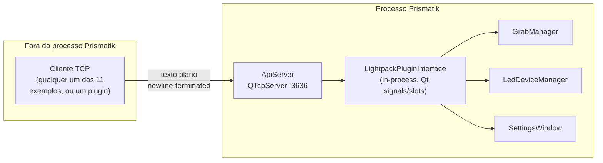
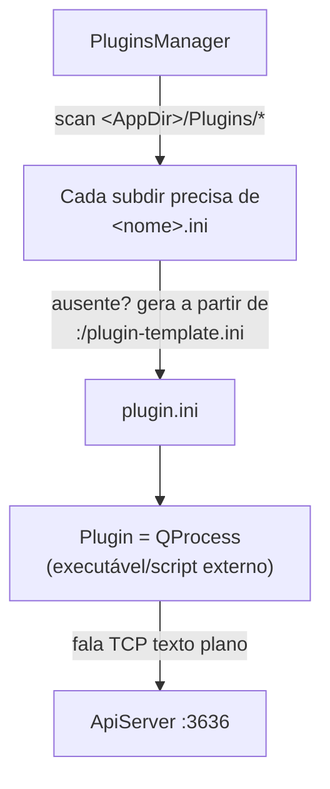

# Ecossistema de plugins e API — como um cliente externo controla o Prismatik

Mapeamento do `ApiServer` (protocolo de rede), do mecanismo de plugins, e dos 11 clientes de exemplo em `Software/apiexamples/`, com foco também na postura de segurança do protocolo.

Ver também: [índice](./README.md) · [pipeline](./pipeline-captura-processamento-leds.md) · [cobertura de testes](./cobertura-testes.md)

---

## 1. Veredito

**A API é um protocolo de texto puro sobre TCP, sem TLS, com autenticação opcional por chave enviada em texto plano — mas segura por padrão (desligada + bind em loopback), e "plugins" na verdade são processos externos falando o mesmo protocolo de rede que qualquer cliente de fora.**

| Aspecto | Estado |
|---|---|
| Protocolo | Texto plano, linha a linha, sobre `QTcpSocket` — sem TLS |
| Porta default | `3636` |
| Habilitada por padrão? | **Não** |
| Bind por padrão | **Só loopback** (`127.0.0.1`) — seguro até o usuário mudar |
| Autenticação | Opcional (só ativa se uma chave for configurada), chave viaja em texto plano |
| "Plugin nativo" (DLL/SO carregado em processo)? | **Não existe** — plugins são processos externos (`QProcess`) que falam com o app pela mesma API de rede |

---

## 2. `ApiServer` — protocolo e comandos

`ApiServer` herda de `QTcpServer` diretamente (`Software/src/ApiServer.hpp:51`) — não é WebSocket, não tem framing binário. Comandos são lidos com `client->readLine().trimmed()` (`ApiServer.cpp:313`): protocolo ASCII terminado em newline. Ao conectar, o servidor já envia um banner (`ApiServer.cpp:41,276`): `"Lightpack API v1.4 - Prismatik API v..."`.

**Porta**: default `3636` (`Api::PortDefault`, `SettingsDefaults.hpp:101`), configurável em runtime (`Settings::getApiPort()/setApiPort()`, `Settings.cpp:684-694`; UI em `SettingsWindow.cpp:577-599`).

### 2.1 Lista de comandos (`ApiServer.cpp:42-180`)

**Leitura** (não exigem lock): `getstatus`, `getstatusapi`, `getprofiles`, `getprofile`, `getdevices`, `getdevice`, `getmaxleds`, `getcountleds`, `getleds`, `getcolors`, `getfps`, `getscreensize`, `getcountmonitors`, `getsizemonitor:`, `getmode`, `getgamma`, `getbrightness`, `getsmooth`, `getpersistonunlock`, `getlockstatus` (+ `getsoundvizcolors`/`getsoundvizliquid` se compilado com `SOUNDVIZ_SUPPORT`).

**Controle de sessão**: `apikey:`, `lock`, `unlock`, `exit`, `help`/`?`.

**Escrita** (exigem `lock` prévio, `ApiServer.cpp:140`): `setcolor:`, `setgamma:`, `setbrightness:`, `setsmooth:`, `setprofile:`, `setdevice:`, `setcountleds:`, `setleds:`, `newprofile:`, `deleteprofile:`, `setstatus:`, `setmode:` (ambilight/moodlamp[/soundviz]), `setpersistonunlock:`.

Esse fluxo `lock` → comandos de escrita → `unlock` existe para que dois clientes não pisem um no outro simultaneamente (ex.: um plugin de mood lamp e um script do usuário competindo pelas mesmas LEDs).

### 2.2 Autenticação — como funciona de verdade

`m_isAuthEnabled = !m_apiAuthKey.isEmpty()` (`ApiServer.cpp:258-262,1249`) — **autenticação é um efeito colateral de ter uma chave configurada, não um toggle independente**. Se o usuário nunca gerou uma chave na UI, a API não pede senha nenhuma.

Fluxo quando há chave:

1. Cliente manda `apikey:<chave>` em texto plano.
2. Servidor compara com `==` string simples (`ApiServer.cpp:340-372`).
3. Qualquer outro comando sem chave válida antes retorna `"authorization required\r\n"` (`CmdApiCheck_AuthRequired`, `ApiServer.cpp:51,376`).

A chave é gerada no cliente (a própria UI do Prismatik) via `QUuid::createUuid().toString()` (`SettingsWindow.cpp:605`) e persistida com `Settings::setApiKey` — `QSettings` puro, **sem hash**, default vazio (`Api::AuthKey = ""`, `SettingsDefaults.hpp:102`). Como o socket não tem TLS, **a chave trafega sem criptografia toda vez que um cliente se autentica** — em uma rede local não confiável (Wi-Fi pública, por exemplo), isso é sniffável.

### 2.3 Postura de segurança — por que isso é menos grave do que parece à primeira vista

- **Desligada por padrão**: `Api::IsEnabledDefault = false` (`SettingsDefaults.hpp:99`).
- **Bind só em loopback por padrão**: `ListenOnlyOnLoInterfaceDefault = true` → `QHostAddress::LocalHost` (`SettingsDefaults.hpp:100`, `ApiServer.cpp:1276-1277`) — um atacante remoto não alcança a porta a menos que o usuário explicitamente troque para "todas as interfaces" (`QHostAddress::Any`).
- **Sem TLS, sem rate limiting, sem throttling** em nenhum ponto de `ApiServer.cpp` — mas isso só importa de verdade se o usuário já decidiu expor a porta na LAN.

Ou seja: o risco real não é "a API é insegura" isoladamente — é "se o usuário abrir a API pra LAN (para controlar por celular, Home Assistant, etc.) sem also configurar uma chave, qualquer dispositivo na mesma rede controla as LEDs sem autenticação; e mesmo com chave configurada, ela trafega em texto plano". Para um recurso de "acender/apagar luz", isso é um risco tolerável para a maioria dos usuários — mas vale ser explícito sobre isso caso a superfície de rede cresça (ex.: comandos que afetem mais do que cor, no futuro).

---

## 3. `LightpackPluginInterface` — não é uma API de extensão, é o hub interno

`Software/src/LightpackPluginInterface.cpp`/`.hpp` é um `QObject` **in-process** (não é DLL/SO carregável, não é IPC) — instanciado uma vez em `LightpackApplication::init` (`LightpackApplication.cpp:674`) e conectado via signals/slots do Qt a `LedDeviceManager`, `GrabManager`, `SettingsWindow`, `SoundManagerBase`. `ApiServer` chama seus slots públicos (`GetLeds`, `SetColors`, `SetLeds`, `Lock`/`UnLock`, `CheckLock`, `GetSessionKey`, `LightpackPluginInterface.hpp:16-74`) para traduzir comandos de rede em ações no device. Também rastreia os processos de plugin (`_plugins`, `updatePlugin`, `LightpackPluginInterface.cpp:54-63`) e arbitra pedidos de lock concorrentes por GUID (`VerifySessionKey`/`Lock`, `:65-74,232-275`).

Ponto importante: **código externo nunca linka contra ou carrega essa classe.** O nome "plugin interface" é um pouco enganoso — é o roteador interno do app, não um ponto de extensão público.

---

## 4. `PluginsManager`/`Plugin` — "plugin" aqui é processo, não DLL

Plugins são **descobertos como subdiretórios**, não DLLs: `LoadPlugins()` varre `<AppDir>/Plugins` (`PluginsManager.cpp:35,39-66`). Cada subpasta precisa de um `.ini`; se faltar, é auto-gerado a partir do recurso embutido `:/plugin-template.ini` (`Plugin.cpp:26-33`). Cada `Plugin` encapsula um `QProcess` (`Plugin.hpp:55`, `Plugin.cpp:65,123-150`) — **um plugin é um executável/script externo, spawnado como processo filho**, não código carregado no mesmo binário.

O `.ini` (`[Main]`) declara `Name`, `Execute`/`ExecuteOnWindows`/`ExecuteOnOSX`/`ExecuteOnNix`, `Icon`, `Author`, `Version`, `Description` (HTML permitido), `Guid` (`Plugin.cpp:36-61`; template em `Software/res/plugin-template.ini:11-70`). `PluginsManager::StartPlugins()`/`StopPlugins()` iniciam/matam o processo conforme `isEnabled()` (`PluginsManager.cpp:86-109`).

O próprio template deixa isso explícito — `Software/res/plugin-template.ini:7`:

> "to make your code interact with Prismatik enable the web server and checkout Software/apiexamples"

**Confirma a arquitetura**: um "plugin" e um cliente externo qualquer (script Python, app C#, o que for) usam exatamente o mesmo canal — a API de rede TCP da seção 2. A única diferença é que um plugin é um processo que o Prismatik sabe iniciar/parar automaticamente por você; ele não tem nenhum privilégio ou acesso adicional que um cliente externo não teria.

---

## 5. Os 11 exemplos em `Software/apiexamples/`

| Pasta | Linguagem/plataforma | O que é |
|---|---|---|
| `Android/` | Java/AppInventor | Clientes Android (`DroidPack`, `LightpackDrive_AppInventor`) |
| `C#/` | .NET/Windows | Apps de exemplo: `CpuMemMonitor`, `CpuMonitor`, `VolumeLight` |
| `Delphi/` | Pascal/Delphi | Plugin de visualização Winamp (`Winamp Lightpack-DISCO`) e plugin AIMP |
| `EventGhost/` | Python | Plugin para a ferramenta de automação EventGhost |
| `LUA/` | Lua | Biblioteca de scripting genérica |
| `PocketBook LightpackDrivePB/` | C (cross-compile ARM) | Driver para e-reader PocketBook (`makearm.sh`/`makepc.sh`) |
| `Ruby/` | Ruby | Biblioteca cliente (`lightpack.rb`) |
| `VisualTests/` | Python | Harness de teste/QA da própria API (`ApiServerStressTest.py` incluso em `pyLightpack/`) |
| `dotnetLightpack/` | .NET | Biblioteca `libLightpack` + app de teste WinForms |
| `liOSC/` | Python | Ponte OSC (Open Sound Control) |
| `pyLightpack/` | Python | Cliente com vários exemplos (`GmailChecker.py`, `SkypeBuddyCheck.py`, `Animexamples.py`) |

Onze linguagens/plataformas diferentes implementando o mesmo protocolo de texto simples é, ao mesmo tempo, evidência de que o protocolo é fácil de reimplementar (bom sinal de design) e de que não existe uma biblioteca cliente oficial única mantida — cada exemplo é independente, sem indicação de qual é "a" referência.

---

## 6. Integração com Home Assistant é 100% externa

Confirmado: `README.md:54` linka `https://github.com/zomfg/home-assistant-prismatik` — projeto de terceiro, fora deste repositório. Busca por `home-assistant`/`homeassistant`/`zomfg` em todo o código (`.py`, `.cpp`, `.hpp`, `.cs`, `.rb`, `.lua`) não retorna nenhuma ocorrência fora dessa linha do README. Não há nenhum código de integração dentro deste repositório — é só um link.

---

## 7. Arquivos-âncora

| Área | Arquivo |
|---|---|
| Servidor/protocolo | `Software/src/ApiServer.{cpp,hpp}` |
| Hub interno | `Software/src/LightpackPluginInterface.{cpp,hpp}` |
| Gerenciador de plugins | `Software/src/PluginsManager.{cpp,hpp}`, `Software/src/Plugin.{cpp,hpp}` |
| Template de plugin | `Software/res/plugin-template.ini` |
| Exemplos de cliente | `Software/apiexamples/` |
| Defaults de segurança | `Software/src/SettingsDefaults.hpp` (`Api::*`) |
