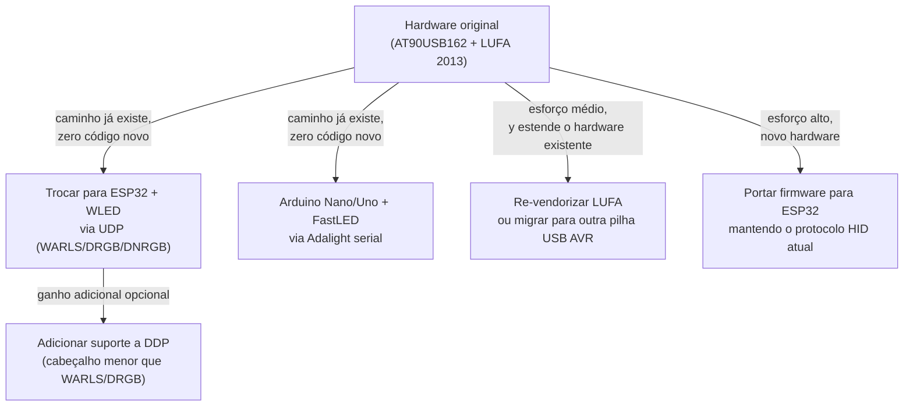

# Firmware e hardware — o quanto isso envelheceu

O mesmo tipo de análise que já fizemos para o lado software ([`gargalos-sistema-moderno-2026.md`](./gargalos-sistema-moderno-2026.md), [`captacao-cor-ainda-moderna.md`](./captacao-cor-ainda-moderna.md)), aplicada ao firmware AVR e ao hardware original deste repositório — não ao ecossistema de devices de terceiros que o Prismatik já sabe falar (Adalight, WLED via UDP, etc).

Ver também: [índice](./README.md) · [pipeline](./pipeline-captura-processamento-leds.md) · [gargalos 2026](./gargalos-sistema-moderno-2026.md)

> Todas as referências externas abaixo foram verificadas (WebSearch/WebFetch) em 2026-07-26. Nenhuma citação sem link — lição da auditoria de [`pesquisa-zonas-led-content-aware.md`](./pesquisa-zonas-led-content-aware.md), que continha duas referências fabricadas.

---

## 1. Veredito

**O MCU original (AT90USB162) continua em produção — não é obsolescência de componente. O que envelheceu é a pilha de firmware (LUFA vendorizada, parada desde 2013) e a proposta de valor do hardware frente a um ecossistema (WLED/ESP32) que o próprio Prismatik já trata como cidadão de primeira classe no software.**

| Camada | Ainda viável? |
|---|---|
| Comprar o MCU hoje (AT90USB162) | **Sim** — "In Production" na Microchip, não é NRND |
| Compilar o firmware hoje (`gcc-avr`) | **Sim** — toolchain AVR8 é mainstream, empacotado em toda distro Linux, e o próprio CI builda isso (`build-fw`, ver [`ci-build-release.md`](./ci-build-release.md) §2) |
| A pilha USB (LUFA vendorizada) está atualizada | **Não** — parada em 2013 neste repo |
| O design de hardware (schematics/board) está atualizado | **Parcialmente** — `Hardware/CHANGELOG` não documenta a versão hw7 que o firmware já suporta por default |
| A proposta é competitiva frente ao que a comunidade DIY usa hoje | **Não** — o próprio software deste repo já trata WLED/ESP32 como recomendação preferencial |
| Arduino clássico (Nano/Uno) + Adalight ainda é uma opção legítima? | **Sim** — é o caminho de DIY mais comum na prática, já suportado sem mudanças, mas sem um "firmware moderno" equivalente ao WLED (ver §3.1) |

---

## 2. O que existe hoje

### 2.1 MCU: AT90USB162

`Firmware/Makefile:16`: `MCU = at90usb162`. É um AVR 8-bit da Microchip (ex-Atmel):

| Especificação | Valor |
|---|---|
| Flash | 16 KB |
| RAM | 512 B |
| Clock | 16 MHz (`Firmware/Makefile:19`, `F_CPU = 16000000`) |
| USB | 2.0 Full-Speed nativo (até 12 Mbit/s) |
| I/O | 22 pinos, encapsulamento TQFP 32 pinos |

Fonte (verificada): [datasheet Microchip AT90USB162](https://ww1.microchip.com/downloads/en/DeviceDoc/7707S.pdf); status de linha de produção confirmado em [microchip.com/en-us/product/AT90USB162](https://www.microchip.com/en-us/product/AT90USB162) como **"In Production"**, não NRND (Not Recommended for New Designs). Ou seja: quem quiser fabricar hardware Lightpack original hoje ainda consegue comprar o chip — a limitação não é disponibilidade, é capacidade (512 B de RAM e USB Full-Speed são o teto físico, não uma escolha de projeto revisável via firmware).

### 2.2 LUFA — pilha USB parada há mais de uma década (neste repo)

`Firmware/LUFA/Version.h` declara copyright **2013** (Dean Camera). `git log -1 -- Firmware/LUFA/Version.h` confirma o último touch neste repositório em **2013-08-12**.

Comparado ao upstream: o fork mantido pela comunidade em [`abcminiuser/lufa`](https://github.com/abcminiuser/lufa) tem commits mais recentes que isso (copyright no código chegando a 2021), mas a própria conta do autor original aparece marcada como inativa/arquival no GitHub — ou seja, mesmo o upstream está em modo de manutenção limitada, não desenvolvimento ativo. **A cópia vendorizada neste repositório está ainda mais atrás** que esse upstream já-parado — 8 anos de defasagem adicional, no mínimo.

Na prática isso significa: nenhuma correção de segurança ou compatibilidade da pilha USB feita no upstream (se houver) chega a este firmware automaticamente — é preciso re-vendorizar manualmente, coisa que não acontece desde 2013.

### 2.3 Hardware — changelog não documenta a versão que o firmware já assume como default

`Hardware/CHANGELOG` lista versões até **hw6.0L** (fevereiro de 2012) como a mais recente (`grep -n "^Version" Hardware/CHANGELOG` — 12 entradas, a mais alta é `hw6.0L`). `git log -1 -- Hardware/` confirma o último touch em **2012-04-24**.

Só que `Firmware/Makefile:14` define `LIGHTPACK_HW?=7` como **default** de build, e `Firmware/version.h:38-40` já tem um branch de compilação inteiro para `LIGHTPACK_HW == 7`. Ou seja: o firmware já assume/suporta uma revisão de hardware (`hw7`) que não está documentada em `Hardware/CHANGELOG` nem tem schematic/board correspondente versionado nesta pasta — o `Hardware/Lightpack.sch`/`.brd` presentes datam, na melhor das hipóteses, de 2012. Isso é uma lacuna de documentação real, não necessariamente um problema de design: é plausível que hw7 exista fisicamente e o changelog/board simplesmente não tenha sido atualizado neste repo.

---

## 3. O que a comunidade DIY usa hoje (e por que isso já entrou no software deste repo)

O ponto central deste documento não é "AVR é ruim" — é que o **próprio README e o próprio `LedDeviceManager`** já tratam a alternativa moderna como recomendação preferencial, enquanto o firmware/hardware original deste repo continua congelado. Entre os dois extremos (placa Lightpack original vs. ESP32+WLED), existe um caminho intermediário extremamente comum na prática — Arduino clássico + Adalight — que também já é suportado sem nenhuma mudança de código (seção 3.1).

> `README.md:64,69`: "ESP8266/ESP32 ([WLED](https://github.com/Aircoookie/WLED) firmware highly recommended)"

### 3.1 Arduino clássico (Nano/Uno, ATmega328) + Adalight — o caminho de DIY mais comum

Existe um terceiro caminho, distinto tanto do firmware AVR nativo deste repo (seção 2) quanto do WLED (seção 3.2): um Arduino Nano/Uno barato (ATmega328P) + fita endereçável (WS2812/NeoPixel) + biblioteca [FastLED](https://fastled.io/), rodando o sketch "Adalight" clássico (atribuído a Wifsimster, amplamente reutilizado — inclusive citado como compatível com Boblight/Hyperion/Prismatik no próprio comentário do sketch) e falando serial via o chip USB-serial da placa (FTDI/CH340 — **não** é USB HID nativo como o AT90USB162 da seção 2.1).

Esse não é um caso hipotético: é o setup real de pelo menos um usuário consultado durante a escrita deste documento (57 LEDs, `DATA_PIN 3`, `FastLED v3.001`, `serialRate 115200`).

**O protocolo bate byte a byte com o que este repositório já implementa.** `LedDeviceAdalight.cpp:323-336` monta o cabeçalho exatamente como o sketch espera:

```
'A','d','a'  →  hi  →  lo  →  checksum (hi ^ lo ^ 0x55)  →  RGB × N
```

| Parâmetro | Sketch Adalight/FastLED típico | Prismatik (device Adalight) |
|---|---|---|
| Baud rate | `115200` | default `115200` (`SettingsDefaults.hpp:114`) |
| Ordem de cor | Lê `r,g,b` na ordem recebida, sem reordenar | `ColorSequence` default `"RGB"` (`SettingsDefaults.hpp:113`) |
| Checksum | `hi ^ lo ^ 0x55` | idem (`LedDeviceAdalight.cpp:336`) |
| Limite de LEDs | Definido em `#define NUM_LEDS` no sketch | Até 511 no device Adalight (`enums.hpp:103`) |

**Armadilha real, não hipotética**: o sketch de referência lê `hi`/`lo` só para validar o checksum — o loop que lê as cores usa `NUM_LEDS` fixo, hardcoded em tempo de compilação, **ignorando** o valor de `hi`/`lo` recebido:

```cpp
if (chk != (hi ^ lo ^ 0x55)) { /* ... */ }        // hi/lo só validam o checksum
for (uint8_t i = 0; i < NUM_LEDS; i++) { /* ... */ }  // NUM_LEDS fixo, não hi<<8|lo
```

Se a contagem de LEDs configurada no Prismatik (device Adalight) não bater **exatamente** com o `NUM_LEDS` compilado no sketch, o stream serial desalinha silenciosamente — sintoma típico é LEDs piscando errado ou parecendo travados, sem erro explícito de nenhum dos dois lados. Não é um bug do Prismatik nem do sketch isoladamente; é uma armadilha de integração entre os dois que vale documentar porque não aparece em nenhum log.

**Não existe "WLED" equivalente para esse hardware.** Fui verificar diretamente no perfil do autor do HyperHDR/HyperSerial (`awawa-dev`, citado adiante na seção 3.3) se existe uma variante para AVR clássico, na mesma linha de `HyperSerialESP32`/`HyperSerialEsp8266`/`HyperSerialPico` (Raspberry Pi Pico) — **não existe** (verificado 2026-07-26, listagem de repositórios do perfil). O ATmega328P (2 KB RAM, sem USB nativo, depende de um chip USB-serial à parte) não tem, hoje, um caminho de firmware "moderno" — Adalight a 115200 baud já é, na prática, o padrão consolidado para esse hardware específico, não uma solução datada esperando substituição.

Isso também significa que, na prática, **o gargalo desse tipo de setup quase nunca é o Arduino**: com poucas dezenas de LEDs (a tabela de FPS×baud em [`gargalos-sistema-moderno-2026.md`](./gargalos-sistema-moderno-2026.md) §3.5 estima ~140 FPS para ~25 LEDs, ~37 FPS perto de 100), a ponta serial fica bem acima da taxa de captura padrão do Prismatik (~20 FPS). Se o usuário sentir lentidão nesse tipo de setup, o primeiro lugar a olhar é o grab interval do Prismatik, não a placa — **"smooth" não é um botão disponível aqui** (ver próxima subseção).

#### Smoothing: não existe nenhum, em nenhuma ponta, para este device

O `gargalos-sistema-moderno-2026.md` §3.2 documenta o `smooth` do firmware AVR nativo (device Lightpack, `Firmware/LedManager.c`) como um dos maiores contribuintes de lag percebido. Vale deixar explícito: **isso é exclusivo do device Lightpack nativo — não existe equivalente para Adalight/Ardulight (nem para os devices UDP WARLS/DRGB/DNRGB)**, nem no host nem no firmware/sketch:

- `LedDeviceAdalight::setSmoothSlowdown` é um stub vazio — só emite sucesso, não faz nada:
  ```cpp
  void LedDeviceAdalight::setSmoothSlowdown(int /*value*/)
  {
      emit commandCompleted(true);
  }
  ```
  (`LedDeviceAdalight.cpp:172-175`; o mesmo padrão existe em `LedDeviceArdulight.cpp`.)
- `Software/src/GrabManager.cpp` não tem nenhuma lógica de interpolação temporal entre frames — `grep -n "smooth\|interpolat" Software/src/GrabManager.cpp` não retorna nada. O diff de cor (seção "Pós-processamento" do [`pipeline-captura-processamento-leds.md`](./pipeline-captura-processamento-leds.md)) decide *se* envia um frame novo, não *como* transicionar até ele.
- O sketch Adalight de referência (seção acima) também não interpola — cada `FastLED.show()` aplica o array `leds[]` recém-recebido diretamente, sem blend com o valor anterior.

Resultado prático: toda transição de cor nesse caminho é um corte duro — o LED pula de uma cor pra outra a cada frame que passa no diff, sem nenhuma suavização em lugar nenhum da cadeia.

#### Corte duro vs. transição curta — o que vale mudar

Pergunta que motivou esta seção: ir de azul pro verde em ~150ms é melhor que um corte instantâneo? **Sim, na maioria dos casos** — com uma ressalva sobre a duração.

- **Por que corte duro tende a incomodar**: mudanças abruptas de cor no campo periférico da visão são um gatilho de atenção (a luz "pisca" para o cérebro, mesmo sem literalmente piscar) — o oposto do papel do Ambilight, que é estender a cena sem competir com ela por atenção.
- **Por que suavização demais também é ruim**: o próprio `smooth=100` do firmware nativo (~0,4s, `gargalos-sistema-moderno-2026.md` §3.2) já é citado como fonte de lag perceptível — a luz deixa de acompanhar cortes de cena reais (uma explosão, um corte de edição) e fica "gelatinosa".
- **Por que ~150ms tende a ser um bom meio-termo**: é rápido o bastante para não parecer atrasado frente a um corte de cena real, e lento o bastante para deixar de ser lido como flash. Como o grab do Prismatik roda por padrão a ~50ms, 150ms equivale a espalhar a transição por ~3 ciclos de captura — não é uma suavização agressiva no seu contexto, é uma micro-transição.
- **Ressalva**: nem toda mudança de cor no captured frame é um "corte" de verdade. Se a cena muda gradualmente (câmera se movendo), frames consecutivos já são parecidos — a suavização "de graça" já existe. Quem mais se beneficia de uma transição curta é justamente o corte seco de conteúdo (troca de cena, corte de edição), que hoje vira um salto abrupto de LED sem nenhuma suavização.

#### Como fechar essa lacuna, se quiser

Duas opções, sem alterar o protocolo Adalight (que não carrega informação de "duração da transição" — só a cor alvo):

1. **No sketch do Arduino** (mais simples, não depende de mudança no Prismatik): em vez de aplicar o `leds[]` recebido diretamente em `FastLED.show()`, guardar a cor-alvo recebida e, a cada iteração do `loop()`, avançar a cor atual de cada LED uma fração do caminho até o alvo (interpolação linear simples), limitada a uma janela de ~150ms independente da taxa de chegada de frames pela serial. Isso mantém o Prismatik e o protocolo intocados — a suavização vira uma responsabilidade só do firmware, coerente com como o device Lightpack nativo já faz (`Firmware/LedManager.c`), só que num MCU diferente.
2. **No host** (mais invasivo, exigiria mudança neste repositório): implementar interpolação genérica em `GrabManager` ou numa camada nova entre `LedDeviceManager` e os devices seriais/UDP, similar ao que HyperHDR faz no host (citado em [`captacao-cor-ainda-moderna.md`](./captacao-cor-ainda-moderna.md) §4.1) — mais trabalho, mas beneficiaria todos os devices sem smoothing (Adalight, Ardulight, WARLS, DRGB, DNRGB), não só quem reescrever o próprio sketch.

Para quem já tem um Arduino rodando (como o caso desta seção), a opção 1 é a de menor esforço e maior controle — não depende de nenhuma mudança no Prismatik nem no protocolo.

#### Robustez do sketch: leitura bloqueante sem timeout

Ponto separado, notado na revisão do sketch de referência: os loops `while (!Serial.available());` não têm timeout. Se o Prismatik parar de enviar bytes no meio de um frame (cabo solto, app travado), o Arduino trava esperando indefinidamente, sem forma de desistir e voltar a procurar o próximo `'A','d','a'`. Na prática isso raramente aparece — o Prismatik reenvia periodicamente ("last will" a cada 100ms se a porta está livre, `LedDeviceAdalight.cpp`) — mas é uma fragilidade real se a conexão cair de forma incomum (não é um problema deste repositório, é uma característica do sketch de referência amplamente reutilizado pela comunidade).

### 3.2 WLED — já suportado via protocolo, não precisa de firmware novo neste repo

[WLED](https://github.com/wled/WLED) (o link do README aponta para `Aircoookie/WLED`; o projeto hoje vive em `wled/WLED`, "originally created by Aircoookie, now maintained by a community of contributors" — 18,4 mil estrelas, verificado 2026-07-26) roda em ESP8266/ESP32: WiFi nativo, múltiplos núcleos (nos modelos ESP32), ordens de grandeza mais RAM/flash que o AT90USB162.

O Prismatik já fala com WLED **sem precisar de firmware customizado** — via os protocolos UDP que `LedDeviceWarls.cpp`, `LedDeviceDrgb.cpp` e `LedDeviceDnrgb.cpp` já implementam:

| Protocolo | Limite de LEDs/pacote | Fonte |
|---|---|---|
| WARLS | 255 | [kno.wled.ge/interfaces/udp-realtime](https://kno.wled.ge/interfaces/udp-realtime/) |
| DRGB | 490 (sem índice — atualiza tudo) | idem |
| DNRGB | 489 por pacote, com índice inicial (permite >490 LEDs via múltiplos pacotes) | idem |

Ou seja: a "modernização de hardware" para quem monta um setup novo já é possível **hoje, sem tocar em uma linha deste repositório** — só usando ESP32 + WLED como device, apontado por UDP. O gap está em quem já tem o hardware original (AT90USB162 + firmware AVR) e não tem caminho de upgrade sem trocar a placa.

### 3.3 Transporte: USB HID Full-Speed vs. alternativas mais rápidas

Já documentado em [`gargalos-sistema-moderno-2026.md`](./gargalos-sistema-moderno-2026.md) §3.4: o Lightpack fala USB HID com report de 64 B, endpoint de 8 B, poll ~5 ms. Dois pontos de comparação externos, verificados:

- **[HyperSerialESP32](https://github.com/awawa-dev/HyperSerialESP32)** (awawa-dev, mesmo autor do HyperHDR já citado em outros docs desta pasta): driver serial USB de alta velocidade para ESP32, atingindo 2 Mbit/s por padrão (até 4–5 Mbit/s em alguns modelos) — ordens de grandeza acima do HID Full-Speed original, usando o mesmo cabo USB, mas com um MCU diferente do outro lado.
- **[DDP (Distributed Display Protocol)](http://www.3waylabs.com/ddp/)**: protocolo UDP desenhado especificamente para displays LED distribuídos, cabeçalho de 10 bytes (contra 126 bytes do E1.31/sACN) — mais eficiente que os protocolos que o Prismatik já suporta. **Confirmado: o Prismatik não implementa DDP hoje** (`grep -rln "DDP" Software/src/ Software/grab/` não retorna nada; os `LedDevice*.cpp` existentes cobrem Adalight, AlienFx, Ardulight, Dnrgb, Drgb, Lightpack, Virtual, Warls — DDP não está na lista).

---

## 4. Síntese — onde investir, se for o caso



| Opção | Esforço | Isso já é possível hoje? |
|---|---|---|
| Migrar para Arduino Nano/Uno + FastLED (Adalight) | Baixo (usuário final) | **Sim** — já é o caminho de DIY mais comum, só bater `NUM_LEDS` do sketch com a contagem no Prismatik (ver §3.1) |
| Migrar para hardware ESP32 + WLED | Baixo (usuário final) | **Sim** — só configurar o device como WARLS/DRGB/DNRGB |
| Adicionar suporte a DDP no software | Baixo–médio | Não implementado; seria um novo `LedDeviceDdp.cpp` seguindo o padrão dos UDP existentes |
| Re-vendorizar/atualizar a LUFA no firmware AVR | Médio | Mantém o hardware original vivo, mas não resolve as limitações físicas do AT90USB162 (512 B RAM, Full-Speed) |
| Portar o firmware para ESP32 mantendo o protocolo/comando atual | Alto | Substituiria a necessidade da LUFA inteira; ganha WiFi nativo, RAM/flash muito maiores |

Não há nada neste documento que exija ação — é um mapa de opções, no mesmo espírito dos outros docs de pesquisa desta pasta. A conclusão mais direta é que **a via de menor esforço já é suportada pelo software**: quem precisa de hardware mais capaz não precisa esperar nenhuma mudança neste repositório, só trocar o hardware físico por ESP32+WLED e apontar o Prismatik para ele via UDP.

---

## 5. Arquivos-âncora

| Área | Arquivo |
|---|---|
| MCU/build firmware | `Firmware/Makefile` |
| LUFA vendorizada | `Firmware/LUFA/Version.h` |
| Versão de hardware assumida | `Firmware/version.h` |
| Schematics/board | `Hardware/Lightpack.sch`, `Hardware/Lightpack.brd`, `Hardware/CHANGELOG` |
| Devices UDP já suportados | `Software/src/LedDeviceWarls.cpp`, `LedDeviceDrgb.cpp`, `LedDeviceDnrgb.cpp` |
| Device serial Adalight/Ardulight | `Software/src/LedDeviceAdalight.cpp`, `LedDeviceArdulight.cpp` |
| Recomendação WLED no próprio projeto | `README.md:64,69` |

### Referências externas (verificadas 2026-07-26)

- AT90USB162 — datasheet: https://ww1.microchip.com/downloads/en/DeviceDoc/7707S.pdf
- AT90USB162 — status de produção: https://www.microchip.com/en-us/product/AT90USB162
- LUFA (fork comunitário): https://github.com/abcminiuser/lufa
- FastLED: https://fastled.io/
- WLED: https://github.com/wled/WLED
- WLED — protocolos UDP realtime (WARLS/DRGB/DNRGB): https://kno.wled.ge/interfaces/udp-realtime/
- HyperSerialESP32: https://github.com/awawa-dev/HyperSerialESP32
- Perfil `awawa-dev` (confirma ausência de variante HyperSerial para AVR clássico — só ESP32/ESP8266/Pico): https://github.com/awawa-dev?tab=repositories
- DDP — especificação: http://www.3waylabs.com/ddp/
