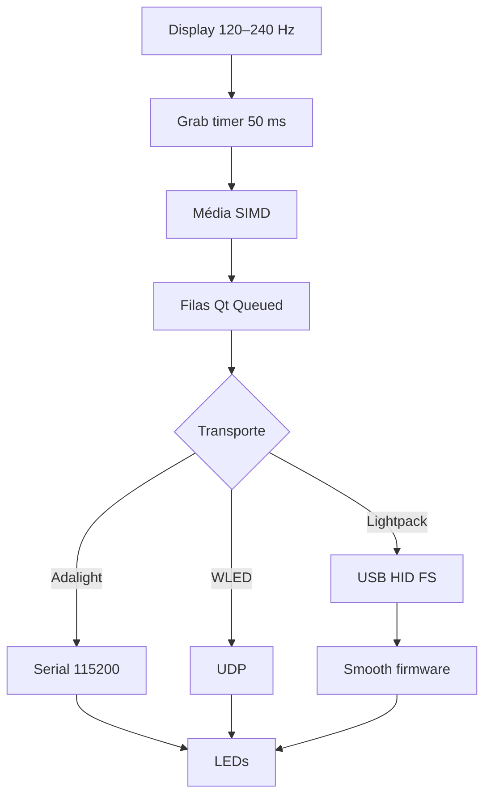

# Gargalos do Ambilight num sistema moderno (2026)

Análise de onde o pipeline Prismatik/Lightpack perde tempo e responsividade em um PC atual (CPU/GPU rápidas, monitores 120–240 Hz, multi-monitor, HDR, HiDPI, USB3), com base no código deste repositório.

Documento complementar a:

- [`pipeline-captura-processamento-leds.md`](./pipeline-captura-processamento-leds.md) — fluxo ponta a ponta
- [`captacao-cor-ainda-moderna.md`](./captacao-cor-ainda-moderna.md) — modernidade do método de cor
- [`pesquisa-zonas-led-content-aware.md`](./pesquisa-zonas-led-content-aware.md) — zonas / ultrawide

---

## 1. Veredito

Em 2026, o teto de responsividade **não é CPU, GPU nem NVMe**.

O Ambilight fica atrás da tela por:

1. **Amostragem lenta** (timer de grab ~20 FPS por default)
2. **Smooth temporal no firmware** (default 100)
3. **Transporte legado** (USB HID Full-Speed / serial 115200)

Captura e média de pixels, no hardware atual, são baratas.

```text
[Display 240 Hz ~4 ms]
    → QTimer grab 50 ms          ← HOST CAPTURE (principal)
    → média SIMD / buffer /8     ← PROCESSING (barato)
    → Queued ×2 + fila 1-in-flight ← SCHEDULING (médio)
    → HID FS / Serial 115200     ← TRANSPORT (crítico multi-device / muitas LEDs)
    → smooth 100 no AVR          ← FIRMWARE (principal no “feeling”)
    → LEDs
```

---

## 2. Ranking por impacto

| # | Gargalo | Tipo | Impacto 2026 |
|---|---------|------|--------------|
| 1 | `Grab/Slowdown` default **50 ms (~20 FPS)** | Host capture | Crítico vs 120–240 Hz |
| 2 | Firmware **smooth default 100** | Firmware | Lag visual ~centenas de ms |
| 3 | Grab **síncrono na thread da UI** | Threading | Latência + jitter; limita subir FPS |
| 4 | USB HID Lightpack: report 64 B, EP **8 B**, poll **~5 ms** | Transport | Multi-device escala mal |
| 5 | Adalight **115200** + drop se TX cheio | Transport | Teto FPS com muitas LEDs |
| 6 | DDupl: create/map texturas por frame; só 8-bit | Capture waste / HDR gap | Desperdício; HDR quebrado |
| 7 | Fila device (1 in-flight, coalesce) | Scheduling | +1 frame sob I/O lento |
| 8 | Multi-monitor sequencial | Capture | Custo linear por tela |
| — | `calculateAvgColor` / pós-processamento host | Processing | **Não é gargalo** hoje |

---

## 3. Detalhamento dos gargalos

### 3.1 Intervalo de grab (~20 FPS) — maior limite de “acompanhar a tela”

**Defaults** (`Software/src/SettingsDefaults.hpp`):

```text
Grab::SlowdownMin     = 1
Grab::SlowdownDefault = 50   // ms → ~20 FPS
Grab::SlowdownMax     = 1000
```

**Comportamento** (`Software/grab/GrabberBase.cpp`):

- `QTimer` com `Qt::PreciseTimer`
- slot `grab()` roda no **mesmo thread** do grabber (thread da UI)
- dentro do slot: descoberta de telas → `grabScreens()` → `calculateAvgColor` por zona → só então `frameGrabAttempted`
- é **síncrono**: o próximo tick só ocorre depois que o slot retorna

**Por que dói em 2026:** monitor a 240 Hz atualiza a cada ~4,2 ms; o Ambilight amostra a cada **50 ms** (~12 frames de atraso médio só na amostragem). Mesmo com Slowdown=1, o pipeline não é “vsync do display”; é polling por timer.

---

### 3.2 Smooth do firmware — muitas vezes limita mais que o host

**Defaults host:** `Device::SmoothDefault = 100`, `RefreshDelayDefault = 100`  
**Firmware** (`Firmware/Lightpack.c`): `smoothSlowdown = 100`, `timerOutputCompareRegValue = 100`  
MCU a **16 MHz**.

A cada tick do Timer1, `smoothIndex` avança até `smoothSlowdown`; a cor interpola `start → end` (`Firmware/LedManager.c`). Com smooth=100, a transição completa leva ~100 ticks do ISR.

Ordem de grandeza (HW ≥ 6, Timer1 típico): taxa efetiva ~F_CPU/65536 ≈ **244 Hz** → transição com smooth=100 ≈ **~0,4 s** até estabilizar. Isso é **lag de suavização**, não de captura.

`CMD_SET_SMOOTH_SLOWDOWN`: **0 = smooth off** (`Firmware/LightpackUSB.c`).

**Conclusão:** em setup Lightpack “de fábrica”, o firmware smooth pode atrasar a percepção mais que baixar o grab para 10–16 ms. Host a 60–100 FPS + smooth=100 ainda “amolece” cortes rápidos de cena.

---

### 3.3 Threading Qt: grab na UI + fila até o device

Fluxo real:

1. Timer → `GrabberBase::grab` (UI) — captura + médias  
2. `frameGrabAttempted` → `GrabManager` via **`Qt::QueuedConnection`**  
3. `updateLedsColors` → `LedDeviceManager::setColors` (**Queued**, outra thread)  
4. `ledDeviceSetColors` → `AbstractLedDevice::setColors` (**Queued**, thread do device)

**Fila** (`LedDeviceManager`): se um comando está in-flight, `SetColors` é deduplicado; `m_savedColors` sempre atualiza → **frames intermediários são coalescidos (drop), não empilham**. Timeout ~500 ms.

**Impacto:** hops Queued adicionam ~1–2 ms típicos (pouco vs 50 ms). O acoplamento relevante é o **grab bloqueante na UI**, que compete com a GUI e dificulta subir o FPS.

---

### 3.4 USB HID Lightpack — transporte, não “USB3 do PC”

| Item | Valor | Onde |
|------|--------|------|
| Report útil | **64 bytes** | `Firmware/Descriptors.h` |
| Buffer host | **65** (ReportID + 64) | `LedDeviceLightpack.hpp` |
| Endpoint | **8 bytes**, interrupt, poll **~5 ms** | Descriptors |
| LEDs/device | **10** | `kLedsPerDevice = 10` |
| Payload | 6 bytes/LED (8+4 bits) | `LedDeviceLightpack.cpp` |
| Writes/frame | **1 `hid_write` por device** (sequencial) | `setColors` |

PC com USB3 não ajuda: o device é **USB Full-Speed HID**. Multi-Lightpack = N writes síncronos. Ping `CMD_NOP` a cada ~1 s.

Comparado ao grab de 50 ms, 1 device costuma caber; **vários devices + grab agressivo** vira o teto.

---

### 3.5 Adalight serial

- Baud default **115200** (`SettingsDefaults.hpp`)
- Frame: header `Ada` + hi/lo/checksum + RGB×N
- Se `bytesToWrite() > 0` → **pula o frame** e agenda “last will” (~100 ms)
- `setSmoothSlowdown` / refresh no host são no-ops para este device

Teto teórico aproximado:

| LEDs | FPS máx @ 115200 |
|------|------------------|
| ~25 | ~140 |
| ~100 | ~37 |
| ~300 | ~13 |

Com grab default 20 FPS, poucas LEDs não saturam; strips grandes + Slowdown baixo **sim**.

---

### 3.6 DDuplGrabber — bom caminho, custos evitáveis

| Aspecto | Comportamento |
|---------|----------------|
| Timeout acquire | **0** — ritmo = timer |
| Downscale | **mip level 3 → 1/8** via `GenerateMips` |
| Média | Roda no buffer **já downscaled** |
| Formatos | Só `B8G8R8A8` / `R8G8B8A8` → 8-bit; outros → drop |
| Limitações | UAC/secure desktop, exclusive fullscreen → preto / `FrameNotReady` |

**Desperdício 2026:** a cada frame com update pode criar staging + textura full-res com mips, `CopySubresourceRegion`, `GenerateMips`, `Map` — em vez de pool de texturas. Em 4K/multi-monitor o custo de GPU/driver importa mais que a média SIMD.

Desktop Duplication continua sendo caminho certo no Windows; o limite é **API + timer + falta de HDR**, não GDI.

---

### 3.7 `calculateAvgColor` — não é o bottleneck

- **DDupl:** média no buffer **/8**, não full-res
- **Outros grabbers sem scale:** média no buffer nativo da zona (default tipicamente 150×150)
- **SIMD:** scalar → SSE4.1 → AVX2 → AVX512 em runtime (`calculations.cpp`)

Em CPU 2026, somar pixels de zonas é **irrelevante** frente a DXGI/USB.  
(A qualidade da média — 8-bit em espaço gamma — é outro assunto; ver doc de captação de cor.)

---

### 3.8 Pós-processamento host — barato

`GrabManager::handleGrabbedColors` e `AbstractLedDevice::applyColorModifications` operam sobre **N cores** (N = LEDs): temperatura, Night Light, avg global, overbrighten, gamma, Lab threshold, brilho, WB, cap, corrente, dither.

**Não é bottleneck** de FPS em hardware moderno.

---

### 3.9 HDR / 10-bit / wide color — gap funcional

- Pipeline de cor é **8-bit `QRgb`** na captura/média; device expande para 12-bit interno
- DDupl: formatos 10-bit/FP16 → `BufferFormatUnknown` → frame ignorado
- Sem tone-mapping PQ/HLG, sem scRGB, sem managed color
- Há Night Light / temperatura (gamma ramp), não HDR

Em display HDR 2026: Ambilight ou fica escuro/errado, ou falha formatos DXGI.

---

### 3.10 Multi-monitor e HiDPI

- DDupl: um `DuplicateOutput` + `AcquireNextFrame` **por monitor com zona**, em série no mesmo `grab()`
- HiDPI: `GrabWidget::deviceFrameGeometry()` usa `devicePixelRatio`; DDupl captura pixels nativos e aplica `scale`
- Custo cresce **linear com monitores ativos no grab**

---

## 4. O que **não** é gargalo em PC 2026

- CPU single-thread na média de cores (SIMD + zonas pequenas / buffer /8)
- NVMe, RAM, “GPU fraca para Ambilight”
- USB3 do host (o device Lightpack não é USB3 bulk)
- Gamma/dither/WB no host
- Bandwidth de um único HID write a 20 FPS

---

## 5. Separação host vs processing vs transport vs firmware



| Camada | Dominante quando… |
|--------|-------------------|
| Host capture | Defaults; quer acompanhar jogo/filme rápido |
| Firmware smooth | Lightpack com Smooth=100 |
| Transport | Muitos devices HID ou muitas LEDs serial |
| Processing | Quase nunca, no hardware atual |

---

## 6. Ações práticas (contexto 2026)

| Prioridade | Ação | Efeito |
|------------|------|--------|
| 1 | Baixar `Grab/Slowdown` (ex.: 10–16 ms) **e** reduzir/zerar smooth | Responsividade perceptível |
| 2 | Smooth no host (float) em vez de smooth alto no AVR | Feeling moderno sem “gelatina” |
| 3 | Mover grab+média para worker thread | Permite FPS alto sem travar UI |
| 4 | Pool de texturas DDupl + HDR FP16+tone-map | Qualidade + menos custo/driver |
| 5 | Baud maior / protocolo rápido (HyperSerial, DDP) para muitas LEDs | Remove teto serial |
| 6 | Content-aware / blackbar | Evita “atraso perceptual” por cor errada (preto) |

---

## 7. Arquivos-âncora

| Área | Arquivos |
|------|----------|
| Defaults | `Software/src/SettingsDefaults.hpp` |
| Timer / grab | `Software/grab/GrabberBase.cpp` |
| DDupl | `Software/grab/DDuplGrabber.cpp` |
| Média | `Software/grab/calculations.cpp` |
| Pós-processamento | `Software/src/GrabManager.cpp`, `AbstractLedDevice.cpp` |
| Fila device | `Software/src/LedDeviceManager.cpp` |
| HID | `Software/src/LedDeviceLightpack.cpp` |
| Serial | `Software/src/LedDeviceAdalight.cpp` |
| Firmware smooth | `Firmware/Lightpack.c`, `LedManager.c`, `LightpackUSB.c` |
| USB descriptors | `Firmware/Descriptors.h` / `Descriptors.c` |

---

## 8. Resumo

1. **Default 50 ms** impede acompanhar 120–240 Hz — teto estrutural de FPS.  
2. **Smooth=100 no firmware** frequentemente domina o lag visual no Lightpack.  
3. **Grab+média na UI** — acoplamento multi-core ruim; secundário vs (1)/(2), mas limita subir o grab.  
4. **HID FS + EP pequeno + N devices** — transporte do hardware original.  
5. **Adalight 115200** — teto clássico com muitas LEDs.  
6. **DDupl sem pool + sem HDR** — desperdício e buraco funcional, não o motivo do Ambilight “lento” nos defaults.  
7. **Fila Queued** — coalesce (bom), +1 frame sob I/O lento (secundário).
