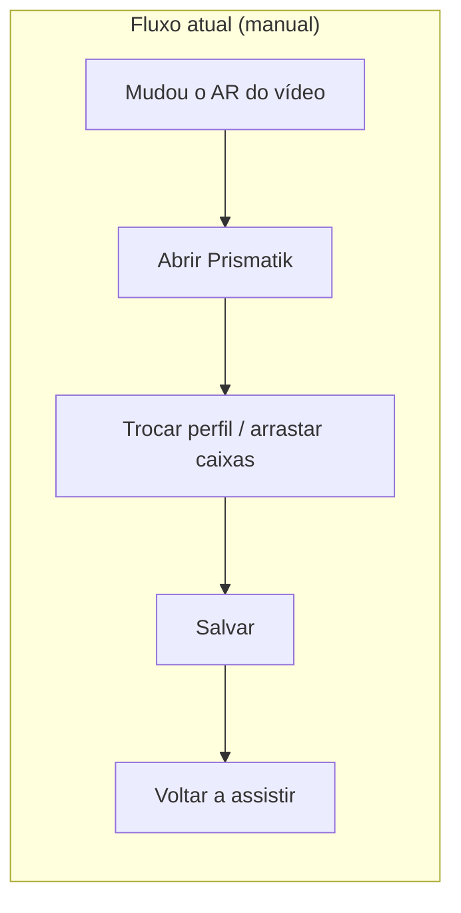
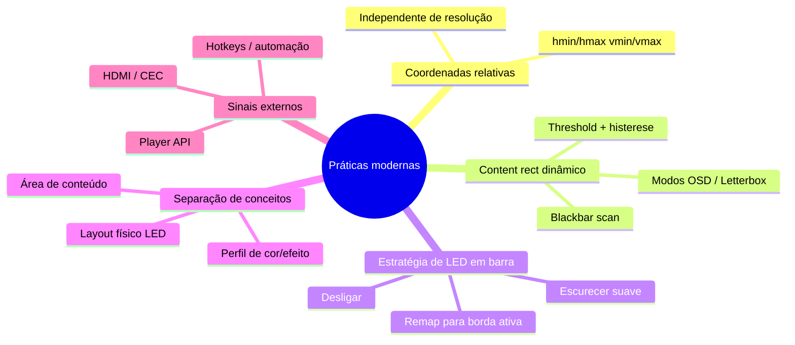
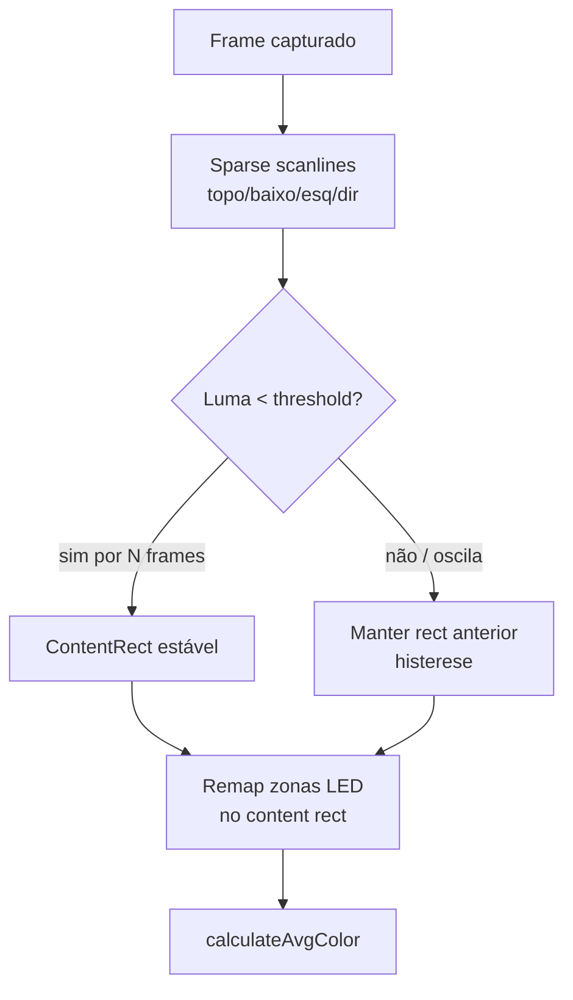
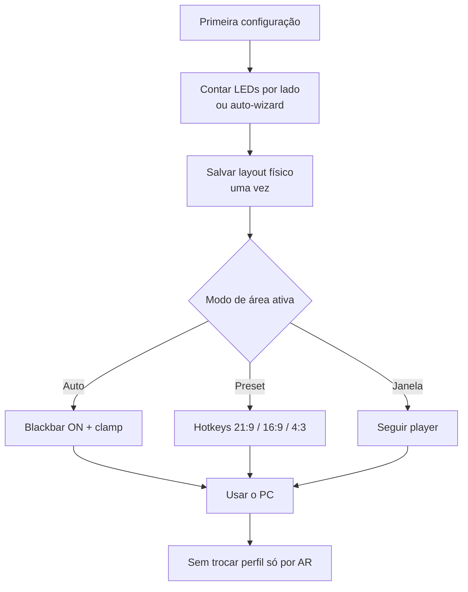

# Pesquisa: configuração eficiente de zonas LED e adaptação ao conteúdo

Documento de pesquisa e design sobre o problema de **caixas/zonas de captura por LED** no Prismatik/Lightpack — especialmente em monitores ultrawide, onde o usuário precisa manter várias configs manuais (desktop 21:9, vídeo 16:9, conteúdo 4:3, etc.).

Inclui: estado atual no código, práticas de sistemas modernos (open-source e comerciais), soluções incrementais, inovadoras e disruptivas, e um roadmap sugerido.

Ver também: [índice](./README.md) · [pipeline](./pipeline-captura-processamento-leds.md) · [gargalos 2026](./gargalos-sistema-moderno-2026.md) · [captação de cor](./captacao-cor-ainda-moderna.md)

---

## 1. O problema (caso ultrawide)

Em um monitor **21:9 / 32:9**, a geometria física dos LEDs é fixa (tira atrás do painel), mas a **área útil do conteúdo** muda o tempo todo:

| Cenário | O que aparece na tela | O que as zonas “erradas” amostram |
|---------|------------------------|-----------------------------------|
| Desktop / jogo nativo UW | Conteúdo preenche o painel | OK se zonas nas bordas do monitor |
| Filme/série 16:9 | Pillarbox (barras pretas laterais) | LEDs laterais → preto / cor morta |
| Conteúdo 4:3 | Pillarbox ainda maior | Laterais + parte do topo/baixo errados |
| Cinema 2.39:1 em UW | Letterbox e/ou pillarbox | Mistura de barras pretas |
| Player em janela | Conteúdo não é fullscreen | Zonas amostram wallpaper/UI |

Hoje, a mitigação típica no Prismatik é:

1. Criar **3+ perfis** (“Desktop”, “Cinema 16:9”, “4:3”)
2. Ajustar manualmente as caixas (`GrabWidget`) em cada um
3. Trocar perfil na mão (combo, hotkey, API `setprofile:`)

Isso é frágil, lento e quebra a imersão — exatamente o oposto do Ambilight.



---

## 2. Como o Prismatik faz isso hoje

### 2.1 Modelo mental

- **1 `GrabWidget` = 1 LED**
- Coordenadas em **pixels absolutos do desktop** (`LED_N/Position`, `LED_N/Size`)
- Distribuição do wizard assume a **borda do monitor**, não a área do conteúdo
- Perfis = arquivos `.ini` separados com geometria completa

### 2.2 Arquivos e chaves relevantes

| Peça | Caminho |
|------|---------|
| Caixas | `Software/src/GrabWidget.{hpp,cpp}` |
| Orquestração | `Software/src/GrabManager.*` |
| Wizard / presets | `Software/src/wizard/ZonePlacementPage.*`, `CustomDistributor.*` |
| Persistência | `Software/src/Settings.*` → `Profiles/<Nome>.ini` |
| API | `ApiServer` / `LightpackPluginInterface` (`getleds`, `setleds`, `setprofile`) |

Chaves por LED (perfil):

```text
LED_N/Position   → QPoint
LED_N/Size       → QSize   (default 150×150)
LED_N/IsEnabled
LED_N/CoefRed|Green|Blue
```

### 2.3 O que já existe e pode ser reutilizado

| Capacidade | Estado | Valor para o problema |
|------------|--------|------------------------|
| Múltiplos perfis + hotkey/API | ✅ | Workaround atual; base para “presets de AR” |
| `setleds` em runtime | ✅ | Remap sem reiniciar |
| Wizard com margens % | ✅ parcial | Margens **não** viram setting persistente de “content rect” |
| `CustomDistributor` | ✅ (com ressalva) | Aceita um `QRect` arbitrário no construtor, mas hoje só é chamado com `screenRect()` (geometria do monitor inteiro) — usá-lo com um content rect seria uso novo, não testado |
| `AreaDistributor::aspect()` | ⚠️ morto | Existe, mas não é usado no layout |
| Detecção de letterbox/pillarbox | ❌ | Gap principal |
| Zonas relativas (0.0–1.0) | ❌ | Tudo é pixel absoluto |
| Ligação a janela do player | ❌ | Gap forte em desktop |

### 2.4 Ineficiências de UX das caixas

1. **Edição visual cara**: arrastar N boxes em ultrawide é tedioso.
2. **Geometria absoluta**: resize de monitor / HiDPI / mudança de escala força reajuste.
3. **Perfil = cópia inteira**: trocar AR exige duplicar brilho/gamma/smooth só para mudar caixas.
4. **Sem preview de “área ativa”**: usuário não vê o content rect alvo.
5. **Sem feedback de “esta zona está em preto”**: difícil saber que o perfil está errado.

---

## 3. Práticas adotadas por sistemas modernos

Pesquisa cobrindo open-source (Hyperion.ng, HyperHDR, adrilight, AmbiTuya) e produtos comerciais (Philips Hue Sync Box, Govee AI Sync Box), além de literatura de TV digital.

> **Nota de verificação (2026-07-26):** a versão original desta seção citava um projeto "Adrilight3" de um autor "AbsenteeAtom" — essa referência não foi localizada (nem o repositório, nem o usuário existem no GitHub) e foi tratada como citação inválida/possível alucinação. Foi substituída abaixo pelo projeto real e verificável `fabsenet/adrilight`, com a afirmação comportamental específica marcada como não confirmada no código.

### 3.1 Hyperion.ng / HyperHDR — referência open-source dominante

**Layout de LEDs em coordenadas normalizadas** (`hmin/hmax`, `vmin/vmax` ∈ `[0.0, 1.0]`), não pixels absolutos. Isso desacopla hardware de resolução.

**Blackbar detection** (documentação oficial Hyperion):

| Modo | Comportamento |
|------|----------------|
| Default | 3 scan-lines em X e Y — detecção rápida |
| Classic | Legacy (só terço superior) — lento / logos atrapalham |
| OSD | Evita oscilar com overlays (volume, info) |
| Letterbox | Só barras topo/baixo; ignora laterais (bom com legendas) |

Fluxo típico:

1. Detectar bordas pretas no frame (threshold configurável; ~0.10 comum para barras “quase pretas”)
2. **Crop lógico** da imagem de análise
3. Remapear amostragem das LEDs para a área ativa
4. Histerese / frames de confirmação para não “piscar” o crop a cada OSD

HyperHDR adiciona editor visual moderno, tone-mapping HDR, e modos mais robustos (ex.: discussão de scanlines configuráveis para legendas — issue HyperHDR #821).

Fontes:
- https://docs.hyperion-project.org/user/advanced/Advanced.html
- https://github.com/hyperion-project/hyperion.ng
- https://github.com/awawa-dev/HyperHDR

### 3.2 adrilight — captura DXGI para Arduino (comportamento de blackbar não confirmado)

adrilight (Windows, C#) captura o desktop via DXGI Desktop Duplication e envia cores para um Arduino/WS2812b via USB CDC — mesma família conceitual do Prismatik/Lightpack.

> ⚠️ **Não confirmado.** A ideia original deste documento — "LEDs sobre a barra preta são remapeados para a borda mais próxima do conteúdo, em vez de apagar" — **não pôde ser verificada** no repositório real. O que existe publicamente é uma *issue* aberta pedindo detecção de barra preta ("Black Bar detection", `fabsenet/adrilight#34`), o que sugere que, na melhor das hipóteses, isso era um pedido de feature e não um comportamento já implementado. Trate a estratégia de "clamp" (política S2 na seção 5.2) como uma proposta de design inspirada por Hyperion/HyperHDR, **não** como algo já validado em produção por este projeto específico.

Fontes:
- https://github.com/fabsenet/adrilight — repositório principal
- https://github.com/fabsenet/adrilight/issues/34 — pedido de detecção de barra preta (aberto, não confirmado como implementado)

### 3.3 AmbiTuya / AmbiScreen

- **Letterbox threshold** configurável
- Crop estático (left/right/top/bottom) + detecção dinâmica
- Signal thresholds por canal RGB para “sem sinal”

> **Correção (2026-07-26):** a versão original citava um "segment editor visual (grid/segments)" para AmbiScreen. A página-fonte consultada (`wiki.ambiscreen.tv/leds-settings/`) documenta apenas parâmetros de configuração via webapp (`cropLeft/Right/Top/Bottom`, `threshold`), **não** um editor visual de segmentos. Esse item foi removido por falta de evidência.

Fontes:
- https://github.com/CmdrAvegan/AmbiTuya
- https://wiki.ambiscreen.tv/leds-settings/

### 3.4 Philips Hue Play HDMI Sync Box

- Processa o **sinal HDMI** (não o desktop)
- Firmware tem histórico de melhorias em **detecção de black bars** para scripts de luz
- Modos Video / Game / Music (intenção de conteúdo)
- Limitação: depende de HDMI in-line; apps do smart TV fora do caminho

Fonte: https://www.philips-hue.com/en-us/support/release-notes/philips-hue-play-hdmi-sync-box (release notes oficiais). **Ressalva:** não localizei uma entrada de changelog específica citando "detecção de black bars" com número de versão/data fixos — a melhoria é mencionada de forma agregada em cobertura de terceiros sobre o produto, não confirmada linha a linha nas release notes.

### 3.5 Govee AI Sync Box / Cogniglow

- Sync via HDMI + “AI” para eventos de jogo
- Setting **Black Bar Elimination** (confirmado em reviews)
- Reviews de monitores **ultrawide curvos** relatam perda de brilho/qualidade em movimento (não necessariamente causada pelo Black Bar Elimination em si — pode ser efeito da curvatura do painel na leitura de cor)
- Lição: “ter o toggle” não basta — a qualidade do detector + estratégia de remap (crop vs rematerializar laterais) importa

Fontes:
- https://gamerant.com/govee-ai-sync-box-2-review/
- https://www.mmorpg.com/hardware-reviews/govee-ai-gaming-sync-box-kit-review-2000127861
- https://www.pcgamer.com/hardware/lighting/govee-ai-sync-box-kit-2-review/

### 3.6 Literatura / broadcast

Paper *Automatic Letter/Pillarbox Detection for Optimized Display of Digital TV* (Carreira & Queluz, SIGMAP/SciTePress, 2014):

- https://www.scitepress.org/PublishedPapers/2014/50642/ (página oficial)
- https://www.scitepress.org/papers/2014/50642/50642.pdf (PDF)
- https://ieeexplore.ieee.org/document/7514520 (versão IEEE Xplore)
- Detectar largura de barras H/V quando AFD metadata não existe
- Caso 1: barras limpas
- Caso 2: legendas/logos **sobre** as barras → não cropar cegamente
- Relevância direta: players de streaming colocam legendas na área preta

### 3.7 Padrões recorrentes (síntese)



O Prismatik hoje tem só o **layout físico em pixels** + **perfis monolíticos**. Falta a camada “área de conteúdo”.

---

## 4. Separação conceitual proposta

Antes de soluções, o modelo de dados ideal:

```text
┌─────────────────────────────────────────────┐
│  A) Layout físico dos LEDs                  │
│     (quantos, ordem, lados, stand gap)      │
│     muda raramente                          │
└───────────────────┬─────────────────────────┘
                    │
┌───────────────────▼─────────────────────────┐
│  B) Content frame / área ativa              │
│     (fullscreen | janela | crop AR | auto)  │
│     muda o tempo todo                       │
└───────────────────┬─────────────────────────┘
                    │
┌───────────────────▼─────────────────────────┐
│  C) Política de amostragem                  │
│     (espessura, densidade, remap barras)    │
└───────────────────┬─────────────────────────┘
                    │
┌───────────────────▼─────────────────────────┐
│  D) Look / device (gamma, brilho, smooth)   │
│     independente da geometria               │
└─────────────────────────────────────────────┘
```

Hoje A+B+C+D estão colados no mesmo perfil `.ini`. É por isso que “3 ARs = 3 configs”.

---

## 5. Soluções — do incremental ao disruptivo

### 5.1 Quick wins (baixo esforço, alto alívio)

#### Q1. Presets de aspect ratio sobre um layout físico

Manter **um** layout de LEDs; aplicar insets pré-calculados:

- `Fill` (21:9 nativo)
- `16:9 centered`
- `4:3 centered`
- `2.39:1 letterbox`

UI: botões/hotkeys / API `setcontentaspect:16:9`.

Reusa `CustomDistributor` com `QRect` = content rect. Persistir só o AR ativo, não duplicar perfil inteiro.

#### Q2. Content margins persistentes

Expor no settings o que o wizard já tem internamente:

```text
Grab/ContentMarginLeft|Right|Top|Bottom   (% ou px)
```

E redistribuir zonas quando mudar — sem abrir o wizard.

#### Q3. Zonas em coordenadas normalizadas

Migrar (ou dual-write) de `Position/Size` pixels para frações 0–1 relativas ao monitor (estilo Hyperion). Resolve HiDPI, mudança de escala e multi-resolução.

#### Q4. Overlay de diagnóstico

Mostrar content rect + “zonas em preto esta frame” (heatmap). Reduz tentativa-e-erro.

#### Q5. Perfis em camadas (overlay)

```text
base: device + look
layer-geometry: content aspect / margins
```

Trocar só a camada de geometria.

---

### 5.2 Soluções sólidas (padrão de mercado — devem entrar)

#### S1. Blackbar / active-area detection (prioridade #1)

Pipeline sugerido no grab já downscaled (DDupl /8):



Parâmetros:

- `threshold` (0–255 ou 0.0–1.0)
- `confirmFrames` (histerese)
- `mode`: `default` | `letterbox` | `pillarbox` | `osd-safe`
- `subtitleSafeBottom` (ignorar centro-baixo)

#### S2. Estratégia para LEDs “sobre a barra”

Três políticas (configurável):

| Política | Comportamento | Quando usar |
|----------|---------------|-------------|
| `off` | LED apaga | Economia / cinema “puro” |
| `clamp` | Amostra a borda do conteúdo (padrão Hyperion/HyperHDR; não confirmado no adrilight, ver §3.2) | **Melhor default UW** |
| `bleed` | Amostra um pouco para dentro + blur | Transições mais suaves |

#### S3. Redistribuição automática das caixas

Quando `ContentRect` muda:

1. Não exigir drag manual
2. Chamar distributor com o novo `QRect`
3. Opcional: animar transição das boxes na UI (só preview; runtime pode ser invisível)

#### S4. Modo “seguir janela do player”

Detectar janela fullscreen/maximizada de apps conhecidos (mpv, VLC, browsers, Netflix app, Steam Big Picture) via Win32/X11/macOS APIs e usar o client rect como content frame.

Complementa blackbar (útil quando o vídeo está em janela).

#### S5. Editor de layout moderno

Substituir “N retângulos flutuantes” por:

- Editor tipo Hyperion (preview + lista + sides counts)
- Presets Andromeda/Cassiopeia/Pegasus já existentes, mas editáveis ao vivo
- Identify LED (piscar LED físico ao hover — HyperHDR faz isso)

---

### 5.3 Soluções inovadoras (diferenciais Prismatik)

#### I1. Dual-space mapping: Monitor Space × Content Space

Manter sempre dois espaços:

- **Monitor space**: onde o LED físico está (borda do painel)
- **Content space**: de onde a cor vem

Mapping function `f: LED_physical → sample_rect_in_content`.

Isso permite efeitos impossíveis com boxes estáticas:

- LED físico no canto UW amostrando o canto do filme 16:9
- “Stretch perceptual” vs “true geometry”

#### I2. Aspect Ratio Router (cenas + regras)

Motor de regras leve:

```yaml
rules:
  - when: { detected_ar: "16:9", app: "mpv" }
    use: { content: "16:9", policy: clamp }
  - when: { detected_ar: "fill", fullscreen: false }
    use: { content: "window-follow" }
  - when: { idle_seconds: 60 }
    use: { mode: moodlamp }
```

Integra com Home Assistant / API já existente.

#### I3. Auto-calibração visual das zonas

Wizard:

1. Mostra padrões coloridos sequenciais nas bordas
2. Captura o frame
3. Inferência da espessura/inset ideal e do gap do pedestal
4. Gera layout sem contar LEDs na mão

(Inspiração: LUT calibration do HyperHDR, mas para geometria.)

#### I4. Preview “ghost content frame”

Overlay semitransparente sempre disponível (hotkey): retângulo da área ativa + AR detectado (`16:9 @ 1840×1035`). Fecha o loop de confiança do usuário.

#### I5. Perfis generativos, não estáticos

Em vez de 3 `.ini`, um **gerador**:

```text
layout(physical) + content(ar|auto) + look(cinema) → zonas runtime
```

O arquivo de perfil guarda intenções, não pixels.

#### I6. Amostragem adaptativa por confiança

Se a zona tem alta variância / está na fronteira content/barra:

- encolher sample rect para dentro
- ou aumentar peso dos pixels “não pretos”

Evita flicker de legendas e bordas suaves (fade-to-black).

#### I7. Multi-content em ultrawide (produtividade)

UW com 2–3 janelas lado a lado:

- detectar regiões ativas por clustering de movimento/cor
- mapear LEDs esquerdos → app esquerdo, direitos → app direito

Ambilight de **desktop workspace**, não só de filme — território pouco explorado pelos produtos TV-centric (Hue/Govee).

---

### 5.4 Soluções disruptivas (mudam a categoria do produto)

#### D1. Prismatik como “Content Geometry Engine”

Virar o produto de “app de caixinhas” para **serviço de geometria de conteúdo**:

- Outros apps (WLED, Home Assistant, games overlays) consomem `ContentRect` + color fields via API
- Prismatik vira o cérebro; LEDs são um sink

#### D2. Semantic / scene-aware lighting

Além de cor média da borda:

- classificar cena (DIA/NOITE, EXPLOSÃO, UI_MENU, CREDITS)
- mudar política de zonas e smooth por cena
- próximo do Cogniglow da Govee, mas open-source e local

Modelo leve on-device (NPU/GPU) opcional; fallback heurístico.

#### D3. Media-pipeline hooks (não só framebuffer)

Integrações diretas:

- **mpv** `vf` / IPC (crop, dimensions reais do vídeo)
- **MPC-HC / VLC** API
- **Browser extensions** (Netflix/YouTube player bounds)
- **Xbox Game Bar / Steam** overlays

Vantagem: AR **exato** sem heurística de barras pretas (e sem falsos positivos de legendas).

#### D4. Aprendizado do usuário

Observar por algumas sessões:

- quando o usuário troca perfil manualmente
- qual AR o detector via
- sugerir automations (“sempre que mpv + 16:9 → preset Cinema”)

#### D5. Captura por camada do compositor

Em vez de desktop blit:

- Windows: Graphics Capture de **janela específica** / Visual Layer
- Wayland: pipewire window capture
- macOS: ScreenCaptureKit por display/window

Zonas deixam de “adivinhar” onde está o vídeo.

#### D6. LED virtual continuum

Abandonar a metáfora de N boxes editáveis:

- strip contínua parametrizada (densidade ao longo do perímetro)
- UI vira curva/spline de sampling depth
- boxes viram detalhe de implementação

Isso elimina 90% da fricção de configuração.

---

## 6. Matriz de decisão

| Ideia | Impacto no problema UW | Esforço | Risco | Reuso no código |
|-------|------------------------|---------|-------|-----------------|
| Q1 Presets AR | Alto | Baixo | Baixo | `CustomDistributor`, API |
| Q2 Margins persistentes | Médio | Baixo | Baixo | Wizard |
| Q3 Coords normalizadas | Médio (base) | Médio | Médio | Settings migration |
| S1 Blackbar detection | **Muito alto** | Médio | Médio | GrabberBase / DDupl buffer |
| S2 Política clamp | Alto | Baixo–médio | Baixo | Pós-detection |
| S3 Redistribuição auto | Alto | Médio | Baixo | Distributor |
| S4 Seguir janela | Alto (desktop) | Médio–alto | OS-specific | Novo módulo |
| I1 Dual-space mapping | Muito alto | Alto | Médio | Refactor GrabManager |
| I7 Multi-window UW | Disruptivo útil | Alto | Alto | Novo |
| D3 Player hooks | Muito alto | Médio por player | Integração | API externa |
| D5 Window capture | Muito alto | Alto | OS APIs | Novo grabber |
| D6 Continuidade / spline | Alto (UX) | Alto | UX rewrite | Wizard+GrabWidget |

---

## 7. Roadmap sugerido

### Fase A — Alívio imediato (sem ML, sem OS hooks)

1. Content margins + presets AR (`Fill` / `16:9` / `4:3` / custom) com hotkeys  
2. Separar “look profile” de “geometry overlay”  
3. Overlay de preview do content rect  
4. API: `setcontentrect`, `setcontentaspect`

**Resultado:** as 3 configs manuais viram **1 layout + troca de AR em 1 atalho**.

### Fase B — Paridade com Hyperion/Adrilight

1. Blackbar detection no frame downscaled  
2. Histerese + modos OSD/Letterbox  
3. Política `clamp` (remap para borda ativa) como default  
4. Redistribuição automática invisível das sample rects  
5. Migrar zonas para coordenadas normalizadas

**Resultado:** na maioria dos filmes/séries, **zero troca manual**.

### Fase C — Desktop-aware (diferencial Prismatik)

1. Follow active player window  
2. Hooks mpv/VLC/browser  
3. Graphics Capture / PipeWire por janela  
4. Regras (Aspect Ratio Router)

**Resultado:** funciona em janela, multi-app e UW de produtividade.

### Fase D — Inovação de produto

1. Dual-space mapping explícito na UI  
2. Auto-calibração por padrões  
3. Semantic scenes (opcional)  
4. Prismatik como geometry engine para o ecossistema

---

## 8. Detalhe de design — detecção de barras (proposta técnica)

### 8.1 Algoritmo baseline (barato)

No buffer já usado pelo grab (idealmente /8 do DDupl):

1. Para cada borda, amostrar 3–5 scanlines (25%, 50%, 75%; no fundo talvez 25%/75% só — anti-legenda).
2. Uma linha é “preta” se mediana de luma < `T`.
3. Avançar para dentro até achar linha “não preta”.
4. Exigir estabilidade por `K` frames (ex.: 8–15 @ 20 FPS ≈ 0,4–0,75 s).
5. Publicar `ContentRect`.
6. Gerar sample rects: perimeter do `ContentRect` com thickness configurável.

### 8.2 Casos difíceis (checklist)

| Caso | Mitigação |
|------|-----------|
| Legendas na barra | Modo letterbox; ignorar centro-baixo |
| Logo de canal no canto | Ignorar cantos / modo OSD |
| Fade-to-black / credits | Timeout: se content shrink extremo por muito tempo, reexpansão lenta |
| UI do player (volume) | Histerese + modo OSD |
| Conteúdo escuro legítimo (night scene) | Threshold + exigir *todas* as bordas / continuidade espacial |
| HDR / elevadores de preto | Operar em luma após tone-map simples; threshold relativo |

### 8.3 Onde plugar no código atual

```text
GrabberBase::grab()
  └─ grabScreens()
  └─ [NOVO] ActiveAreaDetector::update(screens) → ContentRect
  └─ [NOVO] ZoneMapper::sampleRects(physicalLayout, ContentRect, policy)
  └─ calculateAvgColor(...)  // inalterado na essência
```

`GrabWidget` na UI pode continuar mostrando o **layout físico**; as sample rects runtime ficam “por baixo” (com overlay opcional).

---

## 9. UX proposta (configuração das caixas)

### 9.1 Fluxo feliz



### 9.2 Princípios de UI

1. **Nunca pedir 3 perfis para 3 ARs** — pedir 1 layout + política de conteúdo.  
2. Caixas manuais = modo avançado, não o caminho default.  
3. Mostrar o content rect detectado; esconder complexidade do remap.  
4. Hotkeys de emergência (Force 16:9 / Force Fill) para quando o auto falhar.  
5. Um botão “estas laterais estão pretas?” → abre diagnóstico.

---

## 10. Riscos e trade-offs

| Risco | Impacto | Mitigação |
|-------|---------|-----------|
| Falso positivo em cena escura | Crop errado, cores “para dentro” | Histerese, threshold relativo, reexpansão |
| Legendas | LEDs brancos no rodapé | Modo letterbox / subtitle-safe |
| Custo CPU da detecção | Subir grab interval | Sparse scan no /8; rodar a cada N frames |
| Quebra de perfis antigos | Migração | Dual-read pixels + normalizado |
| Usuário power quer boxes manuais | Frustração se remover | Manter modo legacy “Absolute boxes” |

---

## 11. Métricas de sucesso

- Tempo para configurar setup novo: **&lt; 2 min** (hoje: muito mais com N boxes)
- Trocas manuais de perfil por sessão de filme: **→ 0** na maioria dos casos
- % frames com laterais amostrando barra preta em UW+16:9: **&lt; 1%**
- Latência adicional da detecção: **&lt; 1 ms** no buffer /8
- Satisfação: hotkey Force-AR usada **&lt; 1×/hora** quando Auto está on

---

## 12. Referências

### Open-source / docs
- Hyperion.ng Advanced (LED layout + blackbar modes): https://docs.hyperion-project.org/user/advanced/Advanced.html
- Hyperion.ng: https://github.com/hyperion-project/hyperion.ng
- HyperHDR: https://github.com/awawa-dev/HyperHDR
- HyperHDR issue legendas/blackbar: https://github.com/awawa-dev/HyperHDR/issues/821
- adrilight (não "Adrilight3" — ver correção em §3.2): https://github.com/fabsenet/adrilight
- adrilight issue de black bar (feature request, comportamento não confirmado como implementado): https://github.com/fabsenet/adrilight/issues/34
- AmbiTuya (letterbox threshold): https://github.com/CmdrAvegan/AmbiTuya
- AmbiScreen LED/crop settings (sem segment editor visual — ver correção em §3.3): https://wiki.ambiscreen.tv/leds-settings/

### Comercial
- Philips Hue Sync Box release notes: https://www.philips-hue.com/en-us/support/release-notes/philips-hue-play-hdmi-sync-box (melhoria específica de black-bar detection não pinada a uma versão exata — ver ressalva em §3.4)
- Govee AI Sync Box — Black Bar Elimination + relatos de limitação em ultrawide curvo: https://gamerant.com/govee-ai-sync-box-2-review/ , https://www.mmorpg.com/hardware-reviews/govee-ai-gaming-sync-box-kit-review-2000127861

### Academia
- Carreira, L.; Queluz, M.P. — *Automatic Letter/Pillarbox Detection for Optimized Display of Digital TV*, SIGMAP/SciTePress, 2014: https://www.scitepress.org/PublishedPapers/2014/50642/ (PDF: https://www.scitepress.org/papers/2014/50642/50642.pdf ; IEEE Xplore: https://ieeexplore.ieee.org/document/7514520)

### Código local (Prismatik)
- `Software/src/GrabWidget.*`
- `Software/src/GrabManager.*`
- `Software/src/wizard/CustomDistributor.*`
- `Software/src/wizard/ZonePlacementPage.*`
- `Software/src/Settings.*` / `SettingsDefaults.hpp`
- `Software/src/ApiServer.*` / `LightpackPluginInterface.*`
- `Software/grab/GrabberBase.cpp`

---

## 13. Conclusão

O atrito das “3 configs manuais” no ultrawide não é um problema de mais caixinhas — é a falta de uma camada de **área de conteúdo** separada do **layout físico dos LEDs**.

Sistemas modernos resolveram isso com:

1. **coordenadas relativas**
2. **detecção de barras pretas + histerese**
3. **remap (clamp) em vez de apagar LEDs**
4. às vezes **sinal HDMI / captura por janela**

Para o Prismatik, o caminho de maior alavancagem é:

> **Presets/hotkeys de AR (já esta semana) → blackbar+clamp (paridade) → follow-window/player hooks (diferencial desktop) → dual-space / geometry engine (inovação).**

Isso elimina a necessidade de manter três perfis só porque o filme mudou de 21:9 para 16:9 ou 4:3.
