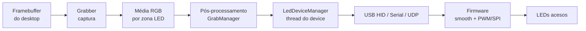
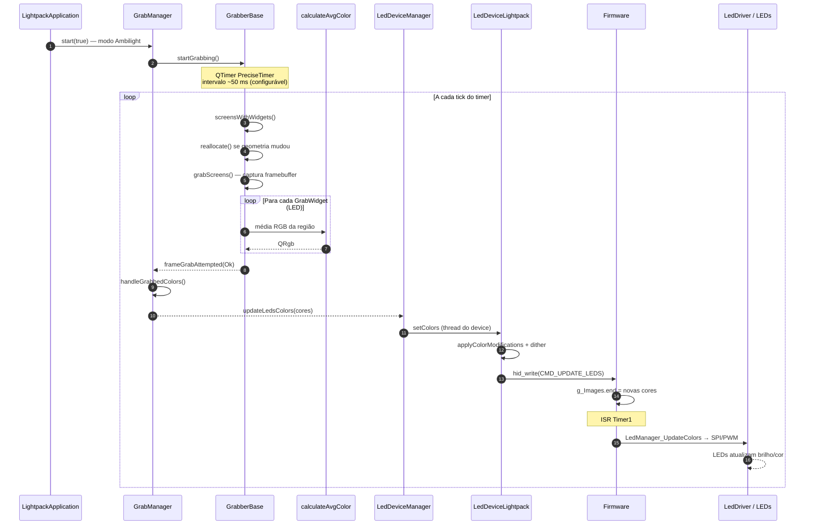
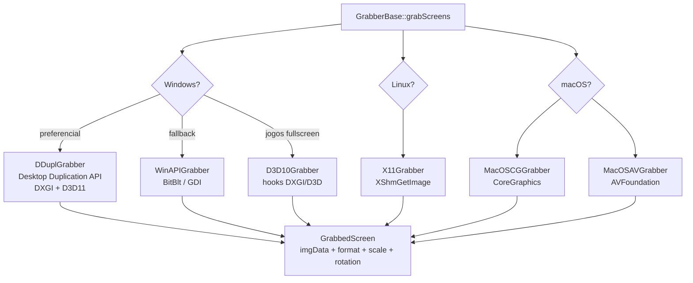
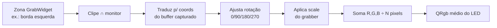
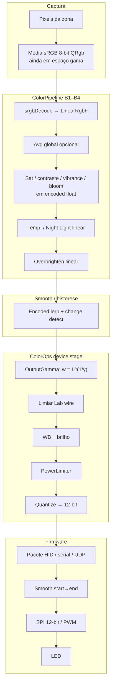
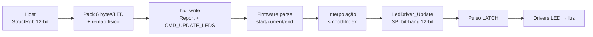
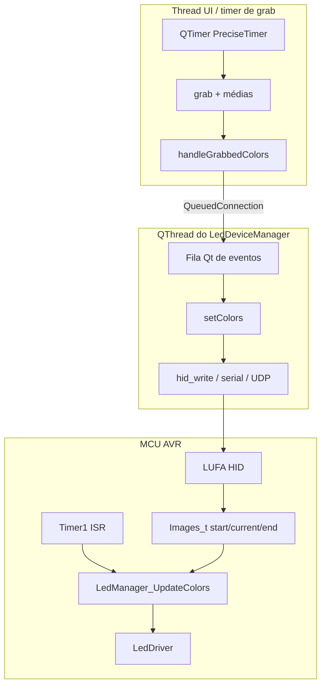

# Pipeline Ambilight: da captura da tela ao LED aceso

Documento técnico do fluxo **Prismatik (host) → dispositivo → firmware → LED**, baseado no código deste repositório.

Ver também: [índice](./README.md) · [gargalos 2026](./gargalos-sistema-moderno-2026.md) · [captação de cor](./captacao-cor-ainda-moderna.md) · [zonas content-aware](./pesquisa-zonas-led-content-aware.md)

---

## 1. Visão geral

No modo Ambilight, o Prismatik não “pinta” a tela: ele **amostra regiões** ao redor do monitor, calcula a **cor média** de cada zona, aplica correções e envia o resultado ao hardware. O LED só muda quando o firmware (ou o driver serial/UDP) recebe esse pacote e atualiza o PWM/SPI.



| Camada | Onde vive | Responsabilidade |
|--------|-----------|------------------|
| Captura | `Software/grab/` | Ler pixels do SO |
| Média por zona | `calculations.cpp` | Ainda `QRgb` 8-bit sRGB (SIMD) |
| Conteúdo (B1–B4) | `ColorPipeline` + `GrabManager` | Decode → float linear → ajustes |
| Dispositivo host | `ColorOps::applyDeviceStage` + `LedDevice*` | `OutputGamma` → wire → quantize + I/O |
| Firmware | `Firmware/` | Smooth temporal + drivers LED |

Modos **Mood Lamp** e **Sound Visualizer** reutilizam o mesmo caminho a partir do `LedDeviceManager`, mas **não** passam pelo grabber.

---

## 2. Arquitetura de componentes

```mermaid
flowchart TB
    subgraph Host["Host — Prismatik (Qt)"]
        App[LightpackApplication]
        GM[GrabManager]
        GW[GrabWidget × N<br/>zonas na tela]
        GB[GrabberBase + QTimer]
        Impl[DDupl / WinAPI / X11 / Mac / D3D10]
        LDM[LedDeviceManager<br/>fila + QThread]
        Dev[AbstractLedDevice<br/>Lightpack / Adalight / UDP…]

        App --> GM
        App --> LDM
        GM --> GW
        GM --> GB
        GB --> Impl
        GM -->|updateLedsColors<br/>QueuedConnection| LDM
        LDM --> Dev
    end

    subgraph HW["Hardware"]
        USB[USB HID / Serial / Wi‑Fi]
        FW[Firmware AVR + LUFA]
        LM[LedManager]
        LD[LedDriver SPI/PWM]
        LED[LED strip / drivers]

        Dev --> USB --> FW --> LM --> LD --> LED
    end
```



### Arquivos-chave

| Arquivo | Papel |
|---------|--------|
| `Software/src/LightpackApplication.cpp` | Liga `GrabManager` ↔ `LedDeviceManager`; registra `QList<LinearRgbF>` |
| `Software/src/GrabManager.cpp` | Orquestra grabbers, zonas; chama `ColorPipeline` + smoothing |
| `Software/src/ColorPipeline.*` | Estágio de conteúdo B1–B4 em `LinearRgbF` |
| `Software/math/ColorOps.*` / `ColorF.h` | Decode/encode sRGB, `renderToWire`, device stage D1–D6 |
| `Software/grab/GrabberBase.cpp` | Loop do timer + cálculo de média por zona |
| `Software/grab/calculations.cpp` | `calculateAvgColor` (média sRGB 8-bit, com SIMD) |
| `Software/src/LedDeviceManager.*` | Fila de comandos e thread do dispositivo |
| `Software/src/AbstractLedDevice.cpp` | Encaminha para `ColorOps::applyDeviceStage` |
| `Software/src/LedDeviceLightpack.cpp` | Empacota cores e faz `hid_write` |
| `Firmware/LightpackUSB.c` | Parse do comando HID `CMD_UPDATE_LEDS` |
| `Firmware/LedManager.c` | Interpolação `start → end` |
| `Firmware/LedDriver.c` | SPI 12-bit / PWM → chips LED |
| `CommonHeaders/COMMANDS.h` | IDs dos comandos host↔device |

---

## 3. Fluxo ponta a ponta (passo a passo)



### 3.1 Inicialização

1. `LightpackApplication` cria `LedDeviceManager` e `GrabManager`.
2. Conexão crítica (assíncrona entre threads):

   ```cpp
   connect(m_grabManager, &GrabManager::updateLedsColors,
           m_ledDeviceManager, &LedDeviceManager::setColors,
           Qt::QueuedConnection);
   ```

3. Com backlight ligado, device desbloqueado e modo Ambilight:

   ```text
   startBacklight() → GrabManager::start(true) → GrabberBase::startGrabbing()
   ```

### 3.2 Loop de captura (`GrabberBase::grab`)

Não há um `while` infinito dedicado. O “main loop” Ambilight é um **`QTimer` preciso**:

1. Descobre monitores que intersectam zonas (`screensWithWidgets`).
2. Realoca buffers se a geometria mudou (`reallocate`).
3. Captura o framebuffer (`grabScreens` — implementação por plataforma).
4. Para cada `GrabWidget`:
   - zona desligada → preto `(0,0,0)`;
   - clipe ao monitor, corrige **rotação** e **escala** (HiDPI / downscale);
   - chama `Grab::Calculations::calculateAvgColor(...)`.
5. Emite `frameGrabAttempted(GrabResultOk|Error|FrameNotReady)`.

Intervalo padrão típico: **50 ms** (`Settings::getGrabSlowdown()`, faixa 1–1000 ms).

### 3.3 Pós-processamento (`GrabManager` → `ColorPipeline`)

A média por zona ainda chega como `QList<QRgb>` (sRGB 8-bit). A partir daí o host trabalha em **float linear** (`LinearRgbF`):

1. **A — decode** (`ColorOps::srgbDecode`): `QRgb` → `LinearRgbF` (LUT 256), uma vez por LED.
2. **B1** — média global opcional de todos os LEDs habilitados (acumulador em linear).
3. **B2** — sanduíche perceptual (só se sat/contraste/vibrance/bloom ≠ default): encode → ops → decode.
4. **B3** — white point / temperatura **ou** blue-light reduction do SO (ganho linear; **não** arrasta mais um segundo gamma).
5. **B4** — overbrighten como ganho de exposição em linear.
6. **C1/C2** — detecção de mudança com histerese + smooth no host em domínio *encoded* (`SmoothingDriver` / `HostColorSmoothing`).
7. `emit updateLedsColors(QList<LinearRgbF>)` (QueuedConnection; metatype registrado no app).

Keep-alive “enviar sempre” (~900 ms) continua existindo para serial.

### 3.4 Camada de dispositivo (host)

`LedDeviceManager`:

- salva as cores e **enfileira** se um comando ainda está em andamento;
- executa I/O numa **`QThread` dedicada**;
- timeout de comando ~500 ms;
- em falha, tenta recriar o device (backoff) e pode pausar o grab.

`ColorOps::applyDeviceStage` (via `AbstractLedDevice::applyColorModifications` sobre `LinearRgbF`):

1. **D1 — render transform** `w = L^(1/γ)` com `Device/OutputGamma` (único gamma de saída; 1.00 = linear físico, ~1.32 = look clássico migrado)
2. **D2** — limiar de luminosidade (Lab) no domínio *wire*
3. **D3** — white balance por LED
4. **D4** — brilho do device
5. **D5** — `PowerLimiter` (cap por LED + PSU numa passada)
6. **D6** — quantização para códigos 12-bit (`StructRgb`); dither separado (`quantizeDithered`) — Lightpack 12-bit permanece sem dither nesta release

Não há mais expansão 8→12 por `×(4095/255)` nem os dois gammas `Grab/Gamma` + `Device/Gamma` na cadeia ativa (ficam no disco só para migração/downgrade).

### 3.5 Empacote USB Lightpack (`LedDeviceLightpack::setColors`)

- Remap físico dos 10 LEDs: `{4, 3, 0, 1, 2, 5, 6, 7, 8, 9}`
- **6 bytes por LED**: 8 bits altos + 4 bits baixos (compatível com HW ≥ 6; HW antigo ignora os 4 baixos)
- Buffer HID: ReportID + `CMD_UPDATE_LEDS` + payload
- `hid_write` por dispositivo (10 LEDs cada); ping `CMD_NOP` periódico

### 3.6 Firmware → LED aceso

1. `CALLBACK_HID_Device_ProcessHIDReport` recebe o report.
2. Em `CMD_UPDATE_LEDS`:
   - `current` vira `start` (ponto de partida do smooth);
   - bytes do host montam `end` (12-bit no HW ≥ 6);
   - se a cor mudou, `smoothIndex[i] = 0`.
3. ISR do **Timer1** chama `LedManager_UpdateColors()`:
   - interpola linearmente `start → end` (se smooth ligado);
   - chama `LedDriver_Update` (SPI 12-bit, ordem BGR, 2 drivers × 5 LEDs) **ou** PWM software no HW 4/5.
4. Pulso **LATCH** nos drivers externos → saída analógica/PWM → **LED acende/atualiza**.

---

## 4. Captura por plataforma



Contrato comum: preencher `GrabbedScreen` (`imgData`, `imgFormat`, `bytesPerRow`, `scale`, `rotation`). O cálculo de média fica sempre em `GrabberBase`.

**DDupl (destaque deste fork):**

- `DuplicateOutput` / `AcquireNextFrame`
- downscale via mipmap (nível 3 → ~1/8) para baratear a média
- acquire com timeout 0 (ritmo vem do `QTimer`)
- desktop seguro / alguns jogos: frame preto ou `FrameNotReady` + retry

---

## 5. Cálculo da cor de cada LED

Cada LED tem um `GrabWidget`: retângulo na tela (coordenadas de device, HiDPI-aware).



`calculateAvgColor`:

- formatos: ARGB / ABGR / RGBA / BGRA;
- média aritmética simples dos pixels da região;
- caminhos otimizados: scalar → SSE4.1 → AVX2 → AVX512 (detectados em runtime).

Intuição: se a zona esquerda mostra um céu azul, a média tende a azul → o LED esquerdo recebe azul.

---

## 6. Pipeline de transformação de cor

Working space pós-grab: **`LinearRgbF`** (luz linear). Tipos auxiliares: `EncodedRgbF` (ops perceptuais), `WireRgbF` (pós-`OutputGamma`, ∝ duty PWM).



| Etapa | Domínio | O quê | Onde |
|-------|---------|--------|------|
| Média espacial | sRGB 8-bit | Cor representativa da zona (viés de Jensen vs média linear) | `calculations.cpp` |
| Decode | → linear | LUT sRGB | `ColorOps` |
| B1–B4 | linear (+ encoded em B2) | Avg, perceptual, temp, overbrighten | `ColorPipeline` |
| Smooth host | encoded float | Interpolação temporal / histerese | `SmoothingDriver` |
| D1 `OutputGamma` | linear → wire | Única transfer function de saída | `ColorOps::renderToWire` |
| D2–D5 | wire | Lab, WB, brilho, PSU/cap | `ColorOps::applyDeviceStage` |
| Quantize | wire → N-bit | Códigos para o device | `ColorOps::quantize` |
| Smooth firmware | códigos | Evita “piscar” entre frames (Lightpack) | `LedManager` |
| SPI/PWM | — | Corrente/intensidade real | `LedDriver` |

**Nota (5.17):** temperatura de cor **não** muda mais o brilho geral (antes o toggle puxava `Grab/Gamma`). Quem usava o toggle como brilho deve ajustar **Output Gamma**.

---

## 7. Formato do pacote Lightpack (USB HID)

Comando: `CMD_UPDATE_LEDS = 1` (`CommonHeaders/COMMANDS.h`).

Por LED (após remap), 6 bytes:

```text
[R8][G8][B8][R4][G4][B4]
 │         │  └────────── 4 bits baixos (HW ≥ 6)
 └─────────┴───────────── 8 bits altos (todos os HW)
```

No firmware (HW ≥ 6):

```text
end.r = (byte0 << 4) | (byte3 & 0x0F)   // idem G e B → 12 bits
```



---

## 8. Threading, buffers e timing



| Componente | Detalhe |
|------------|---------|
| Timer de grab | `Qt::PreciseTimer`, 1–1000 ms (default ~50) |
| Conexão grab→device | `Qt::QueuedConnection` (não bloqueia o grab no I/O) |
| Fila de comandos | 1 comando in-flight; deduplicação de `setColors` |
| Buffers de captura | Por tela em `GrabbedScreen` (DXGI staging, GDI malloc, X11 SHM…) |
| Report HID | 64 bytes úteis (+ ReportID no host) |
| Firmware | Main loop: USB + WDT; LEDs atualizados na ISR do Timer1 |
| Fake grab | ~900 ms se “enviar sempre” (keep-alive) |

---

## 9. Outros protocolos (mesmo pipeline até o device)

A partir de `LedDeviceManager::setColors`, o destino muda:

| Device | Transporte | Payload típico |
|--------|------------|----------------|
| Lightpack | USB HID | `CMD_UPDATE_LEDS` + RGB 12-bit packed |
| Adalight | Serial | Header `Ada` + hi/lo/checksum + RGB×N |
| Ardulight | Serial | `0xFF` + RGB (clamp ≤ 254) |
| DRGB / DNRGB / WARLS | UDP | Header protocolo + timeout + RGB (WLED-like) |
| Virtual / AlienFx | Local / SDK | Simulação ou LightFX |

O caminho **tela → média → pós-processamento** é o mesmo; só o empacote final muda.

---

## 10. Diagrama mental resumido

```text
┌──────────────────┐   média sRGB 8-bit    ┌─────────────────────┐
│  Pixels da tela  │ ─────────────────────► │  QRgb[LED0..LEDn]   │
└──────────────────┘                        └──────────┬──────────┘
                                                       │ srgbDecode
                                                       ▼
                                            ┌─────────────────────┐
                                            │ LinearRgbF + B1–B4  │
                                            │ (ColorPipeline)     │
                                            └──────────┬──────────┘
                                  OutputGamma → wire   │
                                  WB/brilho/PSU/quant  │
                                                       ▼
                                            ┌─────────────────────┐
                                            │  Pacote USB/Serial  │
                                            └──────────┬──────────┘
                                                       ▼
                                            ┌─────────────────────┐
                                            │ Firmware: smooth    │
                                            │ + SPI/PWM           │
                                            └──────────┬──────────┘
                                                       ▼
                                                 💡 LED aceso
```

Em uma frase: **o grabber reduz zonas a médias 8-bit; o host lineariza, ajusta em float e aplica um único Output Gamma até o wire; o firmware interpola e aciona os drivers.**

---

## 11. Como explorar no código

Ordem sugerida de leitura:

1. `Software/src/LightpackApplication.cpp` — wiring, metatype `LinearRgbF`, `startBacklight`
2. `Software/grab/GrabberBase.cpp` — `grab()` completo
3. `Software/grab/calculations.cpp` — média de pixels (ainda 8-bit)
4. `Software/src/ColorPipeline.cpp` / `GrabManager.cpp` — conteúdo B1–B4 + emit float
5. `Software/math/ColorOps.cpp` — decode, `renderToWire`, device stage
5. `Software/src/AbstractLedDevice.cpp` — modificações de cor
6. `Software/src/LedDeviceLightpack.cpp` — `setColors` + HID
7. `Firmware/LightpackUSB.c` — `CMD_UPDATE_LEDS`
8. `Firmware/LedManager.c` + `Firmware/LedDriver.c` — smooth → SPI/PWM
