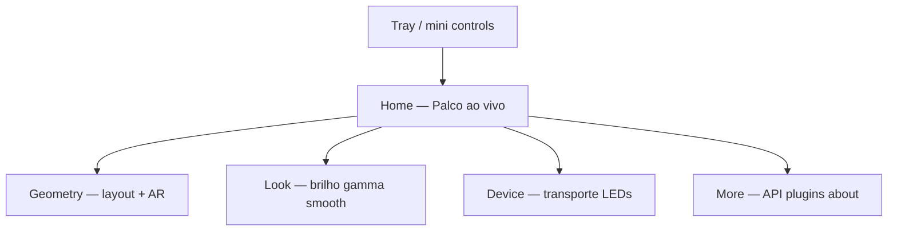

# Reimaginação da UI — Prismatik

Proposta de redesenho da interface do Prismatik (hoje: `SettingsWindow` Qt clássica), alinhada aos problemas já documentados (zonas/AR, gargalos, captação de cor).

**Protótipo interativo:** [`prototypes/prismatik-ui/index.html`](./prototypes/prismatik-ui/index.html)

---

## 1. Diagnóstico do front atual

Com base em `Software/src/SettingsWindow.ui` e screenshots em `screenshots/`:

| Aspecto | Hoje | Problema |
|---------|------|----------|
| Shell | `QMainWindow` 485×668 (exato, `SettingsWindow.ui:6-11`), lista de ícones 64×64 | Visual de ~2010; ocupa espaço sem hierarquia |
| Navegação | Mode / Device / Profiles / Plugins / Expert / About | Tudo no mesmo nível; o que importa (luz ligada, AR, preview) some |
| Mode | Form longo: FPS, checkboxes, sliders, groupboxes | Densidade alta, zero feedback visual da captura |
| Zonas | Overlay `GrabWidget` separado, “Colored/All white/Hidden” | Configuração tediosa; sem content rect / presets AR |
| Preview | Quase inexistente (FPS na status bar) | Usuário não vê o que os LEDs “entendem” |
| Brand | Ícone + título da janela | Brand fraco; poderia ser qualquer settings app |
| Idioma visual | Controles nativos Windows/Qt, ícones skeuomorphic | Não comunica “luz / cinema / desktop moderno” |

A UI atual é um **painel de engenharia**. O produto deveria ser um **controle de luz**.

---

## 2. Princípios do redesign

1. **Luz primeiro** — a primeira vista mostra o palco (monitor + anel de LEDs + content frame), não um formulário.
2. **Brand Prismatik** — nome e marca como sinal dominante do shell, não só favicon.
3. **Uma tarefa por superfície** — Home controla luz; Device calibra hardware; Geometry define zonas/AR; Advanced esconde API/logs.
4. **Content-aware na UI** — presets Auto / Fill / 16:9 / 4:3 são cidadãos de primeira classe (não 3 perfis escondidos).
5. **Progressive disclosure** — gamma, Lab threshold, baud rate existem, mas atrás de “Look” / “Advanced”.
6. **Feedback contínuo** — FPS, device, AR detectado, “laterais em preto?” visíveis sem caçar.

---

## 3. Direção visual — “Halo Desk”

**Não** dark-mode genérico, **não** purple gradient, **não** cream+terracota serif.

| Token | Valor | Papel |
|-------|-------|-------|
| `--ink` | `#0F1C24` | Texto / estrutura |
| `--mist` | `#E7EEF2` | Fundo atmosférico |
| `--paper` | `#F7FAFB` | Superfície de leitura |
| `--lime` | `#A6D400` | Sinal Prismatik (brand/CTA) |
| `--teal` | `#1FA7A0` | Luz secundária / estados live |
| `--coral` | `#E26D5A` | Alerta suave (barra preta / device off) |
| Display | **Syne** | Brand / títulos |
| UI | **Sora** | Labels / controles |

Atmosfera: gradiente radial suave atrás do palco (simula bleed de luz), grain leve, motion só no anel LED e no content-frame.

---

## 4. Arquitetura de telas



### 4.1 Home (vista principal)

Uma composição:

- **Prismatik** (brand)
- Headline curta do estado: “Ambilight · Auto 16:9”
- Palco: silhueta do monitor + glow dos LEDs + retângulo de content
- CTA group: Power · Mode (Ambilight/Mood/Sound)
- Controles essenciais: Content aspect (Auto/Fill/16:9/4:3), intensidade

Sem stats strips, sem API, sem groupboxes na primeira vista.

### 4.2 Geometry

- Preview grande do monitor
- Presets de AR + margens
- Toggle “Blackbar detection” / política clamp
- **Todas as caixas**: largura, altura e espessura (para dentro da tela) aplicadas de uma vez
- **Grupos de LEDs**: criar grupos nomeados (`top`, `bottom`, `sides`…) e ajustar peculiaridades do grupo — **mesmos eixos que o global**: largura, altura, espessura, mais inset e enable — sem LED-a-LED
- Modo avançado: editar zona individual (só quando necessário)

#### Modelo de grupos (protótipo)

```text
LED → lado (top|bottom|left|right) → grupo nomeado
     → overrides: width, height, thickness, inset, enable
```

Caso de uso: pedestal no bottom → grupo `bottom` com altura + espessura maiores e inset; topo fino no `top`. “Aplicar a todas” redefine a baseline (w/h/thick) em todos os grupos; depois cada grupo pode divergir.

Persistência sugerida no app real (além de `LED_N/Position|Size`):

```text
Grab/BoxWidthDefault
Grab/BoxHeightDefault
Grab/BoxThicknessPercent
LEDGroup/<nome>/Members     = side:top | led:3,led:4 …
LEDGroup/<nome>/Width
LEDGroup/<nome>/Height
LEDGroup/<nome>/Thickness
LEDGroup/<nome>/Inset
LEDGroup/<nome>/IsEnabled
```

### 4.3 Look

- Brightness, gamma, smooth (com aviso se smooth firmware alto)
- Temperature / Night Light
- Overbrighten, luminosity threshold

### 4.4 Device

- Tipo (Lightpack / Adalight / WLED…)
- Status conexão, FPS efetivo, baud/HID
- Wizard de setup

### 4.5 More

- Profiles (look vs geometry separados — ver doc content-aware)
- API
- Plugins
- About / logs

---

## 5. Mapa do legado → novo

| UI atual | Destino |
|----------|---------|
| Mode → Screen grabbing form | Home + Look |
| Appearance of grab widgets | Geometry → Overlay |
| Device tabs | Device |
| Profiles + UI locale | More → Profiles |
| Expert → API | More → API (rótulo humano: “Controle remoto”) |
| About | More → About |
| Wizard Qt | Device → Setup / Geometry → Auto layout |
| Status bar FPS/device | Chrome persistente no Home |

---

## 6. Interações-chave (inovação de UX)

1. **Aspect chips** na Home — troca AR sem trocar perfil inteiro.  
2. **Content frame vivo** — anima quando o detector muda (histerese visual).  
3. **Diagnóstico “pretos nas laterais”** — chip coral se zonas laterais ~pretas por N frames.  
4. **Identify LED** — hover numa zona do palco pisca o LED físico (como HyperHDR).  
5. **Tray compacto** — power + aspect + brightness sem abrir a janela.  
6. **Resize global** — um gesto define o tamanho de todas as caixinhas.  
7. **Grupos** — `top` / `bottom` / custom; mesmos controles de largura/altura/espessura (e inset/enable) aplicados ao conjunto de uma vez.

---

## 7. Estratégia de implementação

| Fase | Entrega | Nota |
|------|---------|------|
| **0 — agora** | Este doc + protótipo HTML | Alinha visão sem tocar runtime |
| **1** | QSS / restyle Qt + reorganização de tabs | Ganho rápido no app real |
| **2** | Painel “Stage” (preview cores) no `SettingsWindow` | Reusa `colorsUpdated` / virtual device |
| **3** | Geometry UI (presets AR + margins) | Liga no trabalho content-aware |
| **4** | Opcional: shell web (local UI) falando a API socket | Permite UI rica sem reescrever todo Qt |

Recomendação: **não** reescrever tudo em Electron de primeira. O protótipo define o alvo; a Fase 1–3 entrega valor no binário atual.

---

## 8. Como abrir o protótipo

```bash
# na raiz do repo
xdg-open docs/prototypes/prismatik-ui/index.html
# ou sirva estático:
python -m http.server 8765 --directory docs/prototypes/prismatik-ui
```

---

## 9. Critérios de sucesso do redesign

- Brand test: remover nav → ainda parece Prismatik  
- Home cabível em uma viewport sem scroll em 1280×800  
- Troca 21:9 → 16:9 em **≤ 1 clique / 1 atalho**  
- Usuário vê cor dos LEDs sem olhar para trás do monitor  
- API/plugins fora do caminho crítico
